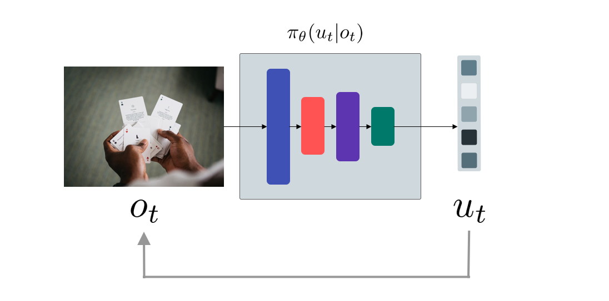

```{r setup, include=FALSE}
knitr::opts_chunk$set(echo = FALSE)
```

## Introduction to the Problem


### Terminology and Notation 

The observation is written as $o_t$. The policy, which is a distribution over action, parameterized by parameter $\theta$ is written as

$$
\pi_{\theta}(u_t|o_t)
$$

where the action is denoted by $u_t$. The state (which isn't always the same as observation, for example, the observation can be pixels, while the state can be the dynamical system) is denoted as $x_t$. Looking at the 

```{r fig.cap="Neual Network Policy returning probability of next action(Image from https://unsplash.com/photos/S2lmGDvs25c, Inspire by in-slide figure)", layout="l-body-outset"}

```

Since the action is effects the observation of the agent, the date we gathered is not *independent and identically distributed* (iid). If we want the action to be continuous, we can have multi-variance gaussian, where the policy outputs mean and variance. 


### Probabilistic Graphical Model

We can a probabilistic graphical model of how components are interacting with each others. 

```{r fig.cap="Graphical Model (Inspire by in-slide figure)", layout="l-body-outset"}
knitr::include_graphics("Images/Figure2.png")
```
The state is called markovian, where the $p(x_{t+1}|x_t, u_t)$ is independent of $x_{t-1}$ (Except for *Partially observable Markov decision process* (POMDP))

---

## Imitation Learning 

### Streightforward Way 
In the natural way, we can do as follows 

  1. Collecting the data (including, reward, observation, and *expert* action)
  
  2. Train Neural Network with the collected data.
  
  3. Using supervised learning to get the policy $\pi_{\theta}(u_t|o_t)$.

There are mainly 2 ways this can gone wrong. 

  1. The data isn't *iid*.
  
  2. There is no expert for us to train.

Furthermore, in theory, this should not work, because if there is a distribution shift the policy neural network might not be able to recover from that, which will cause a chaos. 

```{r fig.cap="Slight Change in the state distribution causes chaos(Inspire by in-slide figure)", layout="l-body-outset"}
knitr::include_graphics("Images/Figure3.png")
```

However, in real-life it works, take a look at NVIDIA's self-driving car[@DBLP:journals/corr/BojarskiTDFFGJM16], where the policy is trained using supervised learning. 

By having 3 cameras attached in 3 different angles (left, right and middle), the car is able to adject itself in case of slight distribution shift by the following technique

  * The middle camera is recording the normal angle, which is used to train the Neural Network
  * The left camera's image, when in training phase the expert's action is added with streering to the right to adjust for distribution shift, and vice versa. 
  
### What can go wrong, when fitting the expert ?

#### Non-Markovian Process

When we saw the same observation twice, we expected to do the same action twice without caring what happend before. However, it is unnatural of human expert to judge what action should be without given any context. 

We can fix this problem using *Recurrent Neural Network* on a variable number of frames. 

#### Multi-Model Behavior
If we want to avoid the obstacle, we can do it in 2 ways: turning left or turning right. There isn't only one answer for this kind of the action, so we can model action to be 

* Output of Mixture of Guassian 
* Implicit Density Model 
* Autoregressive Discretization

### Can we make the model works more often ?

We can have a distribution over training trajectories and have the error correction policy, similar to NVIDIA paper[@DBLP:journals/corr/BojarskiTDFFGJM16]. 

Or, we can make the distribution of the observation, when given the expert policy, matches the distribution of the observation, when given the neural network policy.

$$
p_{\text{data}}(o_t) = p_{\pi_{\theta}}(o_t)
$$

The idea -- instead of being smart about fixing the unforsee changes in observation distribution, be smart about the distribution of the observation itself.

#### DAgger -- Dataset Aggregation [@DBLP:journals/corr/abs-1011-0686]

The goal of this algorithm is to collect the data from the policy, instead of the data from ther expert. By running the policy and let the experts label which action should be performed. 

```{r fig.cap="DAgger Algorithm in Pseudo-Code", layout="l-body-outset"}
knitr::include_graphics("Images/Figure4.png")

# \begin{algorithm}[H]
#     \caption{DAgger -- Dataset Aggregation}
#     \begin{algorithmic}[1]
#         \State Training $\pi_{\theta}(u_t|o_t)$ from human data $\mathcal{D} = \{ o_1, u_1, ...  , o_N, u_N \}$ 
# 
#         \State Run $\pi_{\theta}(u_t|o_t)$ to get the dataset $\mathcal{D}_{\pi} = \{ o_1, ... , o_M \}$ 
# 
#         \State Ask Human to label $\mathcal{D}_{\pi}$ with action $u_t$
#         \State Aggregate: $\mathcal{D} \leftarrow \mathcal{D} \cup \mathcal{D}_{\pi}$
#     \end{algorithmic}
# \end{algorithm}

```

The __problem__: Asking human to label the action (in step 3) doesn't seem natural to us, for example in the self-driving car situation, we won't feels the speed of the car, and so we can't be sure of what action we should take. 

## Case Study 

### Training Forest Trail following as a Classification Problem [@7358076]

The researchers, put 3 cameras and train a Neural Network to classify which direction to go, for example, image from the left hand-side is labeled as turning right.

```{r fig.cap="Image takend from [@7358076]", layout="l-middle"}
knitr::include_graphics("Images/Figure5.png")
```

### DAgger & Domain Adaptation

The reseachers want to make a drone that works in the winter (smaller dataset) from a summer training set[@DBLP:journals/corr/DaftryBH16]. In step 3 of the DAgger[@DBLP:journals/corr/abs-1011-0686], where we ask the human feedback, instead of giving the controller to an expert, we drag a line on the screen, representing what action the drone should take.

```{r fig.cap="Image taken from the lecture", layout="l-middle"}
knitr::include_graphics("Images/Figure6.png")
```

This is better than just a controller because as a human we get the visual feedback. Then, the researchers train Convolutional Neural Network and change the upper layer using special kind of regularization and loss. 

### Imitations with LSTMs [@DBLP:journals/corr/RahmatizadehAB16]

The Neural Network itself is a Recurrent Neural Network and the inputs are the location of the box and gripper, the network will predicts the next location of the gripper. 

```{r fig.cap="Figure from: From Virtual Demonstration to Real-World Manipulation Using LSTM and MDN [@DBLP:journals/corr/RahmatizadehAB16]", layout="l-middle"}
knitr::include_graphics("Images/Figure7.png")
```

Everything is trained in the simulator and can be transfered to the real world, where it losses some performance. However, the result show that the *Mixture Model* and *Recurrent Neural Network* are useful for the task.

```{r fig.cap="Image taken from the lecture", layout="l-middle"}
knitr::include_graphics("Images/Figure8.png")
```

---

## Other Topics 

### Other Topics in Imitation Learning

* Structure Prediction in Chat Bot for example, sequence to sequence prediction, where there is a loss every time-step. This can be a problem if the word changes, the rest of the sequence will change. This problem is the problem of the loss 

* Interactive and Action Learning 

* Inverse Reinforcement Learning, instead of copying the demonstration, figure-out the goal. 

### What is the problem wih Imitation Learning ?

* Human need to provide the data, which is finite, where deep learning works best when data is plentiful. 

* Human can learn autonomously, can machine do the same ? Unlimited Data from own experience, and continuous self-improvement

### Learning Without Human 

We can learn to 

$$
\min_{u_1, ..., u_T} \log P(\text{eaten by tiger} | u_1, ..., u_T)
$$

or 

$$
\min_{u_1, ...,u_T} \sum^T_{t=1} c(x_t, u_t) \text{ s.t } x_t = f(x_{t-1}, u_{t-1})
$$
where $c$ is a cost function or negative of reward. 

#### Cost/Reward Function in Theory and Practive 

For he grabbing arm, we can define the reward to be 

$$
r(x, u) = \begin{cases} 1 &\text{if } \text{object is at the target} \\  0 & \text{otherwise} \end{cases}
$$

This might not be practical because the reward is very sparse. We can define the reward to be 

$$
r(x, u) = -w_1||p_{\text{gripper}}(x) - p_{\text{object}}(x) ||^2 -w_2 || p_{\text{object}}(x) - p_{\text{target}}(x) ||^2 - w_3 ||u||^2
$$

We have to regularized $u$, so that the arm isn't moving too fast. Similary, for walker task, the reward can be 

$$
r(x, u) = \begin{cases} 1 &\text{if } \text{walker is running} \\  0 & \text{otherwise} \end{cases}
$$

Instead, in practical sense, we define the reward to be 


$$
r(x,u) = w_1v(x) + w_2\delta(|\theta_{\text{torso}}(x)| < \epsilon) + w_3\delta(h_{\text{torso}}(x) \ge h)
$$

The cost function of the imitation can be as follows 

$$
c(x, u) = - \log p(u=\pi^*(x) | x)
$$

However, the problem now boils down to the following questions: what is reward ? , How to emulate it ?

#### Reinforcement Learning 

The Problem Statement 

$$
\min \sum^T_{t=1} \mathbb{E}\big[ c(x_t, u_t) \big] \text{ where } x_{t+1} \sim p(x_{t+1}|x_t, u_t)
$$

```{r, echo=FALSE}
htmltools::includeHTML("katex.html")
```