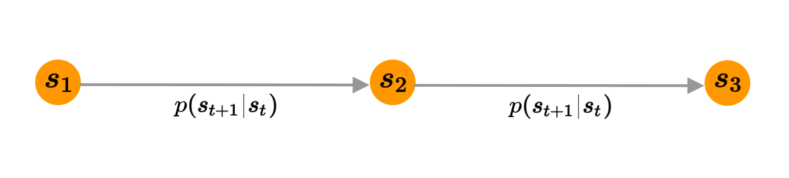
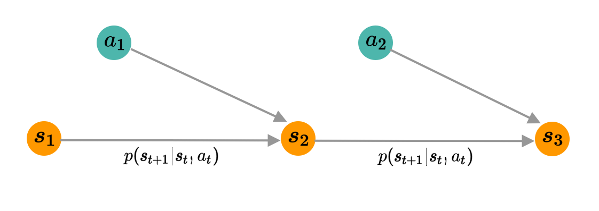
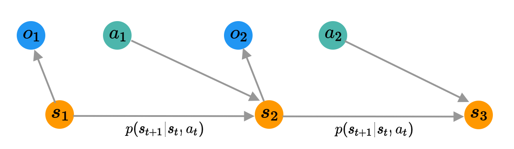
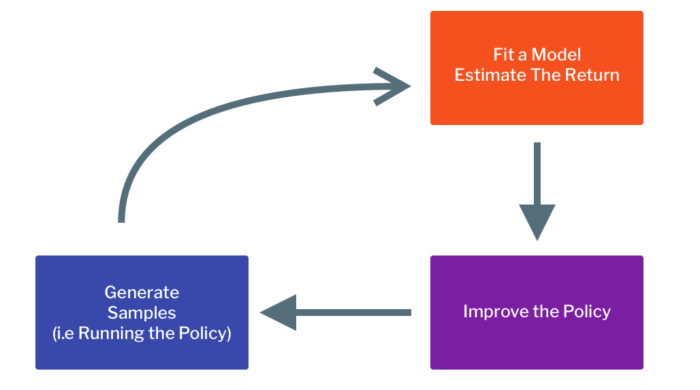
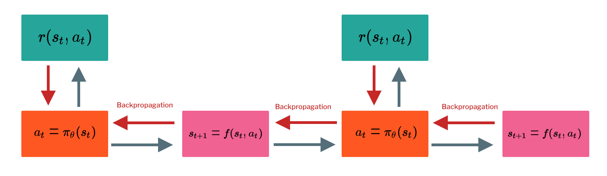
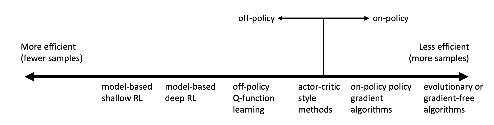

```{r setup, include=FALSE}
knitr::opts_chunk$set(echo = FALSE)
```

## Overview of the Notations and The Problem 

### Reward Function 

The reward function is telling us, whuch action is better or worst given the current state. It is denoted as: 

$$
r(s, a)
$$
This is called reward function.

### Markov Chain 

Markov Chain is defined by 2-elements tuple:

$$
\mathcal{M = \{ S, T \}}
$$

__State Space__ -- $\mathcal{S}$ is called a state space(which can either be discrete or continuous). 

__Transition Probability__ -- $\mathcal{T}$ is the transition operator, which calculates 

$$
p(s_{t+1} | s_t)
$$

Let $\mu$ be the vector of probability of the states 
$$
\mu_{t, i} = p(s_t = i)
$$

Let the transition probability be defined as 

$$
\mathcal{T}_{i, j} = p(s_{t+1} = i | s_t = i)
$$

Applying the Transition Probability to the probability over the states, giving out 

$$
\mu_{i+1} = \mathcal{T} \mu_t
$$

```{r fig.cap="Graphical Model of the Markov Chain(Inspire by in-slide figure)", layout="l-body-outset"}

```

### Markov Decision Process 

Markov Decision Process is defined by 4-elements tuple:

$$
\mathcal{M = \{ S, A, T, r \}}
$$

__State Space__ -- $\mathcal{S}$ is a state space, similar to *Markov Chain* above. 

__Action Space__ -- $\mathcal{A}$ is the action space (action can be discrete or continuous). 

__Transition Operation__ -- Now the transition operation becomes a tensor instread of the matrices. Defined the state distribution given the current timestep as 

$$
\mu_{t, j} = p(s_t = j)
$$
Let $xi$ be the action distribution given the current timestep as 

$$
\xi_{t, k} = p (a_t = k)
$$

Let $\mathcal{T}$ be the transition opeartion be 

$$
\mathcal{T}_{i, j, k} = p(s_{t+1} = i | s_t = j, a_t = k)
$$

The state distribution after the transition would be calculated by 

$$
\mu_{t+1, k} = \sum_{j, k} \mathcal{T}_{ijk} \mu_{tj} \xi_{tk}
$$

__Reward Function__ -- The reward function is defined by 

$$
r : \mathcal{S \times A \rightarrow \mathbb{R}}
$$

```{r fig.cap="Graphical Model of the Markov Decision Process(Inspire by in-slide figure)", layout="l-body-outset"}

```

### Partially Observed Markov Decision Process 

Partially Observed Markov Decision Process is defined by 6-elements tuple.

$$
\mathcal{M = \{ S, A, O, T, E, r \}}
$$

The symbols that are the same as Markov Decision Process have the same meaning. 

__Observation Space__ -- $\mathcal{O}$ is the observation space, where observation can be discrete or continuous. 

__Emission Probability__ -- The observation is conditioned on the current state 
$$
p(o_t|s_t)
$$

```{r fig.cap="Graphical Model of the Partially Observed Markov Decision Process(Inspire by in-slide figure)", layout="l-body-outset"}

```

---

## Goal of Reinforcement Learning

We can define the __policy__ of the reinforcement learning agent as 

$$
\pi_{\theta}(\tau) = p_{\theta}(s_1, a_1, ..., s_T, a_T) = p(s_1) \prod^T_{t=1} \pi_{\theta}(a_t|s_t) p(s_{t+1} | s_t, a_t)
$$

We can say that 

$$
p(s_{t+1}, a_{t+1} | s_t, a_t) = p(s_{t+1} | s_t, a_t)\pi_{\theta}(a_{t+1}|s_{t+1}) 
$$

### Finite Horizon Case

In the finite horizon case, we can define the __objective__ as 

$$
\theta^* = \arg\max_{\theta} \mathbb{E}_{\tau \sim p_{\theta}(\tau)} \left[\sum_t r(s_t, a_t)\right]
$$

which is equivalent to 

$$
\arg\max_{\theta} \sum^T_{t=1} \mathbb{E}_{(s_t, a_t) \sim p_{\theta}(s_t, a_t)} \left[r(s_t, a_t)\right]
$$

### Infinite Horizon Case -- Stationary Distribution

The state transition function can be used as 

$$
\begin{pmatrix} s_{t+k} \\ a_{t+k} \end{pmatrix} = \mathcal{T}^k\begin{pmatrix} s_{t} \\ a_{t} \end{pmatrix}
$$

What if the game is played for ever, does $p(s, at)$ converges to a stationary distribution, aka 
$$
\mu = \mathcal{T} \mu
$$

Rearrange the equation to get 

$$
(\mathcal{T} - I) \mu = 0
$$

Where $\mu$ is the eigenvalue of $\mathcal{T}$ with eigenvalue of 1 (always exists under some regularly condition). Since we will stuck to the stationary distribution forever, we can just maximized the stationary reward. 

$$
\mathbb{E}_{(s, a) \sim p_{\theta}(s_t, a_t)}\left[ r(s, a) \right]
$$

### Expectation and Stochastic System 

In reinforcement learning, we almost always care about expectation. For example, a car on a cliff, the reward function is represented by the car not falling, but the reward expectation according to probability of falling if smooth in $\psi$

$$
\mathbb{E} _{(s, a) \sim p_{\psi}(s, a)}\left[r(s, a)\right]
$$

---

## Overview of Reinforcement Learning Algorithms

### Anatomy of a Reinforcement Learning Algorithm

```{r fig.cap="General Pattern of Reinforcement Learning Algorithm(Inspire by in-slide figure)", layout="l-body-outset"}

```

#### A Fit a model or Estimate the return can be 
  * Computer discounted reward in Monte Carlo policiy gradient algorithm
  * Fit $Q$ for Q-Learning or Actor Critic 
  * Estimate the transition function in Model-Based 
  * Stochastic Gradient Ascent as in Policy Gradient
  
#### For improve the Policy can Be
  * Maximized $Q$-function in Q-learning 
  * Optimized Policy in Model-Based algorithm 
  
#### Which Parts are Expensive 
  * Generate Sample -- Hard if it is real world scenario like a real car or robot. 
  * Fit a Model -- Q-Learning part, which is not trivial to parallelized 
  * Improve the policy -- Optimize Policy, which is not also trivial to parallelized 
  

### Reinforcement Learning by Backpropagation -- Simple Example

```{r fig.cap="Computation Graph for Reinforcement Learning by Backpropagation(Inspire by in-slide figure)", layout="l-body-outset"}

```

This example is fitted through the common theme of reinforcement learning algorithm 
  
  * Collect Data -- Generate Example
  * Update the Model -- Fit The Model 
  * Forward Pass -- Estimate Return 
  * Backward Pass -- Update The Model
  
But this approach to Reinforcement Learning has many issues/restriction, for example, 

This algorithm can only handles *Deterministic* Dynamics and Policy, the state and action must be *Continuous* and the problem itself is difficult optimization problem.

---

## Value Function and Q-Function

### Conditional Expectation 

$$
\sum^T_{t=1} \mathbb{E}_{(s_t, a_t) \sim p_{\theta}(s_t, a_t)} \left[r(s_t, a_t)\right]
$$

We can expand the equation to get. 

$$
\mathbb{E}_{s_1 \sim p(s_1)}\left[ \mathbb{E}_{a_1 \sim \pi(a_1|s_1)}\left[r(s_1, a_1) + \mathbb{E}_{s_2 \sim p(s_2 | s_1, a_2)}[\cdots] \big| s_1\right] \right]
$$
So the $Q$ function for the first state an action is defined by 

$$
Q(s_1, a_1) = r(s_1, a_1) + \mathbb{E}_{s_2 \sim p(s_2 | s_1, a_1)} \left[ \mathbb{E}_{a_2 \sim \pi(a_2| s_2)} [\cdots] \right]
$$

So everything can be reduced to 

$$
\mathbb{E}_{s_1 \sim p(s_1)}\left[ \mathbb{E}_{a_1 \sim \pi(a_1|s_1)} \left[Q(s_1, a_1) | s_1\right] \right]
$$

Now we can easily modify the algorithm to 
$$
\pi(a_1|s_1) = 1 \text{ if } a_1 = \arg\max_{a_1} Q(s_1, a_1)
$$

The *Definition* of Q-Function can be 

$$
Q^{\pi}(s_t, a_t) = \sum^T_{t'=t} \mathbb{E}_{\pi_{\theta}} [r(s_{t'}, a_{t'}) | s_t, a_t]
$$

The *Definition* of Value Function is 

$$
V^{\pi}(s_t) = \sum^T_{t'=t} \mathbb{E}_{\pi_{\theta}} [r(s_{t'}, a_{t'}) | s_t]
$$

which represents the total reward from state $s$, or equivalently 

$$
V^{\pi}(s_t) = \mathbb{E}_{a_t \sim \pi(a_t|s_t)} [Q^{\pi}(s_t, a_t)]
$$

where the Reinforcement Learning objective is equal to 

$$
\mathbb{E}_{s_1 \sim p(s_1)} [V^{\pi}(s_1)]
$$

### Using Q-Function and Value Function 

#### Idea 1 

If we have the policy $\pi$ we know the Q-Functiob of it we can improve the policy by setting, 

$$
\pi'(a_1|s_1) = 1 \text{ if } a_1 = \arg\max_{a_1} Q(s_1, a_1)
$$

This policy is at least as good as the policy before, and this fact doesn't matter what the policy is. 

#### Idea 2 

Computing gradient to increase probability of a good action, so if 

$$
Q^{\pi}(s, a) > V^{\pi}(s)
$$

then the action is better than average. 

--- 

## Types of Reinforcement Learning Algorithm 

* Policy Gradient -- Directly optimize the objective 
* Value Based -- Estimate Value Function or Q-Function of the optimal policy 
* Actor-Critic -- Estimate Value Function or Q-Function of the current policy to improve it 
* Model-Based -- Esitmate the transition model, use it for training or improve policy. 

### Model-Based Algorithm 

We are trying to learn 

$$
p(s_{t+1}| s_t, a_t)
$$

We then improve the policy by 

* Use the model to plan (No explicit Policy Involved)
  * Trajectory optimization with back-propagation to optimized over action 
  * Discrete Planning in Discrete Action Space
  
* Back-Propagation into the policy requires some trick to works 

* Use the model to learn value function via Dynamic Programming or *Dyna* (Generate Experience for Model-Free Learner)


### Value Function Based Algorithm 

We fit a model to estimate $V(s)$ or $Q(s, a)$ and set the policy to be 
$$
\pi(s) = \arg\max_{a} Q(s, a)
$$

### Direct Policy Gradient 

We can improve the policy by 
$$
\theta \leftarrow \theta + \alpha \nabla_{\theta} \mathbb{E} \left[ \sum_r r(s_t, a_t)  \right]
$$

### Actor Critic 

We fit the model to estimate $V(s)$ or $Q(s, a)$, but instead of using the value function to choose the action, we evaluate the return and improve the policy with the help of $V(s)$ or $Q(s, a)$.

<aside>
Actor Critic has similar structure to Direct Policy Gradient. Discuss this in future lecture
</aside>

$$
\theta \leftarrow \theta + \alpha \nabla_{\theta} \mathbb{E} \left[ \sum_r r(s_t, a_t)  \right]
$$

---

## Why there are so many Reinforcement Learning Algorithm ?

For difference algorithm there are 

* Difference Tradeoff 

  * Sample Efficiency 
  * Stability and Ease to Use 

* Difference Assumption

  * Stochastic or Deterministic ? 
  * Discrete or Continuous ?
  * Episodic or Infinite Horizon ?
  
* Difference things are *easy* or *hard* in different settings

### Sample Efficiency 

How many samples do we need to get a good policy ? Is the algorithm *off-policy* ? 

* Off-Policy -- Able to improve the policy without getting new samples from that policy 
* On-Policy -- Need to get new data when policy changes 

```{r fig.cap="Difference Algorithms with Difference Efficiency(In-slide figure)", layout="l-body-outset"}

```

Why would we use a less efficient algorithms ? Wall-Clock Time isn't the same as efficiency. 

### Stability and Ease of Use 

Does the algorithm converges ?  and if it converges, which point it is converged to ? Does it converge everytime ? 

* Supervised Learning -- Almost Always "converges" using gradient descent.
* Reinforcement Learning -- Often not converge under gradient descent 
  * Q-Learning -- Fixed Point Iteration 
  * Model-Based Reinforcement Learning -- The model isn't optimized for expected reward. 
  * Policy Gradient is gradient descept, but also the least efficient. 
  
__Comparison between different types of algorithms__

* Value Function Fitting 

  * At best, it minimizes error (Bellman Error) -- Not the same as expected reward 
  * At worst, it doesn't optimized anything. 
  
* Many popular Deep Reinforcement Learning value fitting algorithm are not guaranteed to converge to anything in non-linear case. 

* Model-Based Reinforcement Learning

  * Model Minimizes error of fit -- This will converge. 
  * No guarantee that better model implies better policy. 

* Policy Gradient 
  * The only one that actual perform gradient descent on the true objective. 


### Assumptions 

__Common Assumption #1 -- Full Observability__

* Generally Assumed by value function fitting method 
* Can be mitigated by adding Recurrence (RNN, etc.)

__Common Assumption #2 -- Episodic Learning__

* Often assumed by pure policy graident methods
* Assumed by some model based Reinforcement Learning methods 

__Common Assumption #3 -- Continuity or Smoothness__

* Assumed by some continous value function methods and some model-based Reinforcement Learning methods 

```{r, echo=FALSE}
htmltools::includeHTML("katex.html")
```