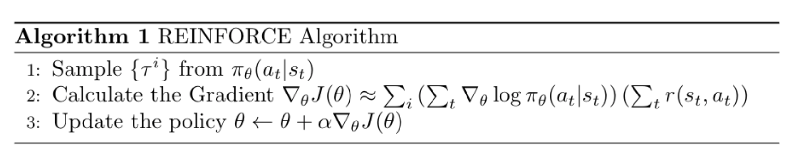
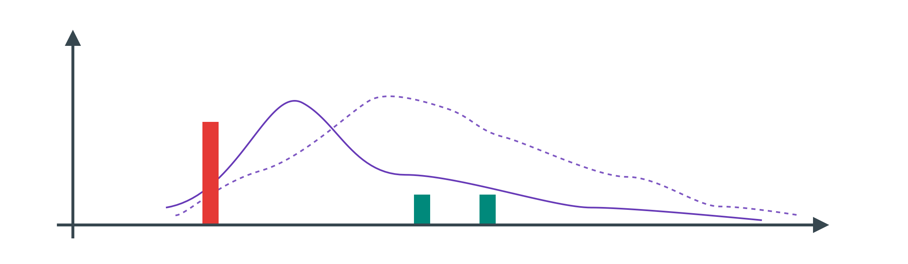
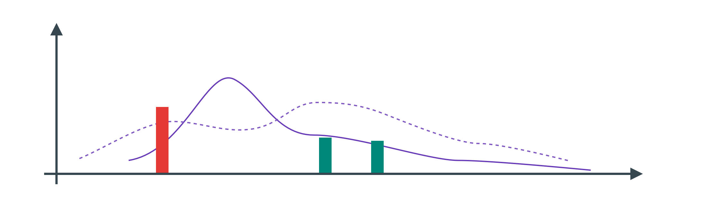
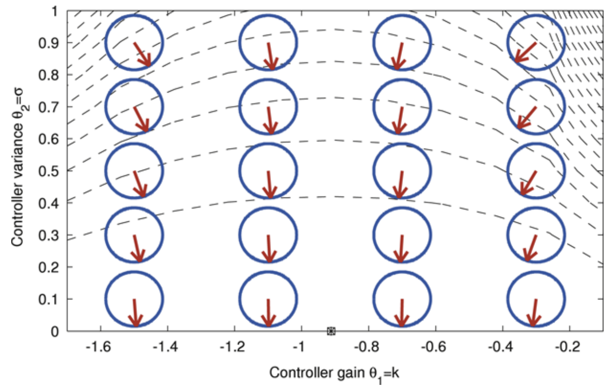

```{r setup, include=FALSE}
knitr::opts_chunk$set(echo = FALSE)
```

## Objective 

$$
\theta^* = \arg\max_{\theta} \mathbb{E}_{\tau \sim p_{\theta} (\tau)} \left[\sum_t r(s_t, a_t) \right]
$$

In this note, we are going to describe/derive policy gradient in the setting of the finite horizon. 

$$
\theta^* = \arg\max_{\theta} \sum^T_{t=1} \mathbb{E}_{(s_t, a_t) \sim p_{\theta}(s_t, a_t)} [r(s_t, a_t)]
$$

## Evaluate The Objective 

Can't evalute exanctly, so we have apporximate it using Monte Carlo method. 

$$
J(\theta) = \mathbb{E}_{\tau \sim p_{\theta}(\tau)} \left[\sum_t r(s_t, a_t) \right] \approx \frac{1}{N} \sum_i\sum_t r(s_{i, t}, a_{i, t})
$$

Running policy under finte horizon. 

### Direct Policy Differentiation 

Looking at the objective first 

$$
J(\theta) = \mathbb{E}_{\tau \sim p_{\theta} (\tau)} [r(\tau)] = \int \pi_{\theta} (\tau) r (\tau) \ d\tau
$$

The derivative is 

$$
\nabla_{\theta}J(\theta) = \int \nabla_{\theta}\pi_{\theta} (\tau) r(\tau) \ d\tau
$$

A convenient identity is 

$$
\pi_{\theta} (\tau) \nabla_{\theta} \log \pi_{\theta}(\tau) = \pi_{\theta}(\tau) \frac{\nabla_{\theta}\pi_{\theta}(\tau)}{\pi_{\theta}\tau} = \nabla_{\theta}\pi_{\theta} (\tau)
$$

So, the derivative becomes 

$$
\nabla_{\theta}J(\theta)  = \int \pi_{\theta} \nabla_{\theta} \log \pi_{\theta}(\tau) r(\tau) \ d\tau = \mathbb{E}_{\tau \sim \pi_{\theta}(\tau)} \left[ \nabla_{\theta} \log \pi_{\theta}(\tau) r(\tau) \right]
$$

Looking at the probability of the policy 

$$
\pi_{\theta}(\tau) = p(s_1) \prod^T_{t=1} \pi_{\theta}(a_t|s_t) p(s_{t+1}|s_t, a_t)
$$

Getting the logrithm of the policy probability distribution 

$$
\log \pi_{\theta} (\tau) = \log p(s_1) + \sum^T_{t=1} \log \pi_{\theta}(a_t|s_t) + \log p(s_{t+1} | s_t, a_t)
$$

When we take the derivative of the log-policy probability distribution, since the other terms are not depending on the parameters. 

$$
\nabla_{\theta} \log \pi_{\theta}(\tau) = \nabla_{\theta} \sum^T_{t=1} \log \pi_{\theta} (a_t|s_t)
$$

And therefore the policy gradient is 

$$
\nabla_{\theta} J(\theta) = \mathbb{E}_{\tau \sim \pi_{\theta}(\tau)} \left[\sum^T_{t=1} \nabla_{\theta} \log \pi_{\theta} (a_t|s_t) * \sum^T_{t=1} r(s_t, a_t) \right]
$$

### Evaluate the Policy Gradient

We are using Monte Carlo method by rolling-out a lot of trajectories. 

$$
\nabla_{\theta} J(\theta) \approx \frac{1}{N} \sum^N_{i = 1} \left( \sum^T_{t=1} \nabla_{\theta} \log \pi_{\theta}(a_t|s_t) * \sum^T_{t=1} r(s_t, a_t) \right)
$$

And we can update the policy using standard gradient ascend. 

$$
\theta \leftarrow \theta + \alpha \nabla_{\theta} J(\theta)
$$

__REINFORCE Algorithm__
```{r fig.cap="REINFORCE Algorithm in Pseudo-Code", layout="l-body"}
# \begin{algorithm}[H]
#     \caption{REINFORCE Algorithm}
#     \begin{algorithmic}[1]
#         \State Sample $\{\tau^i\}$ from $\pi_{\theta}(a_t|s_t)$
#         \State Calculate the Gradient  $\nabla_{\theta} J(\theta) \approx \sum_{i} \left( \sum_{t} \nabla_{\theta} \log \pi_{\theta}(a_t|s_t)\right) \left( \sum_{t} r(s_t, a_t) \right)$
#         \State Update the policy $\theta \leftarrow \theta + \alpha \nabla_{\theta} J(\theta)$
#     \end{algorithmic}
# \end{algorithm}

```

__Comparison to Maximum Likelihood__ -- This algorithm is similar to maximum likelihood. 

$$
\nabla_{\theta} J(\theta) \approx \frac{1}{N} \sum^N_{i=1} \left( \sum^T_{t=1} \nabla_{\theta} \log \theta_{\theta}(a_{i, t} | s_{i, t}) \right)
$$

The policy gradient means that 

* Some trajectory will be good, then we will increases the likelihood
* Some trajectory will be bad, then we will decrease the likelihood. 

### Example with Gaussian Policies 

The policy should looks like 

$$
\pi_{\theta}(a_t|s_t) = \mathcal{N}(f_{NN}(s_t);\Sigma)
$$

The log-policy should now be 

$$
\log \pi_{\theta}(a_t|s_t) = 0.5 || f(s_t) - a_t ||^2_{\Sigma} + \text{ const}
$$

And, the derivative would be 

$$
\nabla_{\theta} \log \pi_{\theta}(a_t | s_t)  = -0.5 \Sigma^{-1} (f(s_t) - a_t) \frac{df}{dt}
$$

### Partial Observability 

We can simply replace $o_t$ with $s_t$, but Markov Property isn't used, so it might not be good here(RNN might mitigate this problem).

$$
\nabla_{\theta}J(\theta) \approx \frac{1}{N} \sum^N_{i=1} \left( \sum^T_{t=1} \nabla_{\theta} \log \pi_{\theta} (a_{i, t} | o_{i, t}) * \sum^T_{t=1} r(o_{i, t}, a_{i, t}) \right)
$$

---

## What is wrong with Policy Gradient ? 

### First Problem (High Variance)

Suppose we have the policy and 3 sample from them, there is one that gives very negative result and the rest give small positives, this causes the policy to change quickly. 

```{r fig.cap="Policy Before/After(dashed-line) Update (Inspired by in-Slide figure)", layout="l-body"}

```

However, if we add the constant the graph will be pushed wider. 

```{r fig.cap="Policy Before/After(dashed-line) Update (Inspired by in-Slide figure)", layout="l-body"}

```

What would happend if 2 rewards is zero and the other is negative ? The policy gradient will push the probability distribution depending on where it started. 

### Second Problem (Slow Convergence)

Suppose a simple policy 

$$
\log \pi_{\theta} (a_t|s_t) = \frac{1}{2\sigma^2} (ks_t - a_t)^2 + \text{ const }
$$

where the parameters are $\theta = (k, \sigma)$ and the reward is defined by 

$$
r(s_t, a_t) = -s_t^2-a^2_t
$$

where we try to make state close to zero, while making action small, however, according to the policy gradient plot

```{r fig.cap="Normal Policy Plot from [@PETERS2008682]", layout="l-body"}

```

You can see that, since we want the action to be small, the system will decrease the $\sigma$, so we get less big action, which is always a good idea. Although the gradient direction is correct, $\sigma$ component will be too large, so the other component will be slow update. 


### Reducing Variance 

__Causality__ 

Causality -- Policy at time $t'$ can't affect reward at time $t$, when 

$$
t' > t
$$

So, we can make the reward term to be, reward to go, instead of summing over all rewards. 

$$
\nabla_{\theta}J(\theta) \approx \frac{1}{N} \sum^N_{i=1} \left( \sum^T_{t=1} \nabla_{\theta} \log \pi_{\theta} (a_{i, t} | s_{i, t}) * \sum^T_{t'=t} r(s_{i, t'}, a_{i, t'}) \right)
$$

This term is smaller in magnitude, overall gradient is small, so we collect the reward to go $\hat{Q}_{i, t}$.

### Baseline 

Adding constant changes the result, with same multiplier, don't want just "How good they are compare to others", but we want "How good they are one average"

$$
\nabla_{\theta} J(\theta) \approx \frac{1}{N} \sum^N_{i=1} \nabla_{\theta} \log \pi_{\theta}(\tau) [r(\tau) - b]
$$

where $b$ can be 

$$
b = \frac{1}{N} \sum^N_{i=1} r(\tau)
$$

We have to show that this will not give a biased estimate 

$$
\mathbb{E} [\nabla_{\theta} \log \pi_{\theta}(\tau) b] = \int \pi_{\theta} (\tau) \nabla_{\theta} \log \pi_{\theta}(\tau) b \ d\tau
$$

This boiled down to 

$$
\int \nabla_{\theta} \pi_{\theta} (\tau) b \ d\tau = b \nabla_{\theta} \int \pi_{\theta}(\tau) \ d\tau = 0
$$

So it is unbiased, subtracting b a baseline is unbiased in expectation, however the average reward isn't the best one. 

__Analyzing Variance__ 

Can we write down the variance, and the finding the lowest varience. 

$$
\text{Var}[x] = \mathbb{E}[x^2] - \mathbb{E}[x]^2
$$

Now the gradient is 

$$
\nabla_{\theta}J(\theta) = \mathbb{E}_{\tau \sim \pi_{\theta}(\tau)} \left[ \nabla_{\theta} \log\pi_{\theta}(\tau)(r(\tau)  - b) \right]
$$

So the variance is equal to 

$$
\text{Var} = \mathbb{E}_{\tau \sim \pi_{\theta}(\tau)} [(\nabla_{\theta} \log\pi_{\theta}(\tau)(r(\tau) - b))^2] - \underbrace{\mathbb{E}_{\tau \sim \pi_{\theta}(\tau)} [\nabla_{\theta} \log\pi_{\theta}(\theta)(r(\tau) - b) ]^2}_{\text{Unbiased Estimate}}
$$

The second term is just the normal gradient, so in order to find the lowest term, we find the derivative.

$$
\begin{aligned}
\frac{d\text{Var}}{db} &= \frac{d}{db} \mathbb{E}[g(\tau)^2 (r(\tau) - b)^2] \\
&= \frac{d}{db} \big( \mathbb{E}[g(\tau)^2r(\tau)^2] - 2 \mathbb{E}[g(\tau)^2r(\tau)b] + b^2\mathbb{E}[g(\tau)^2] \big)
\end{aligned}
$$

Which is equal to (and we set it equal to zero)

$$
\mathbb{E}[g(\tau)^2r(\tau)] + 2b\mathbb{E}[g(\tau)^2] = 0
$$

The baseline that gives the lowest variance is equal to 

$$
b = \frac{\mathbb{E}[g(\tau)^2r(\tau)]}{\mathbb{E}[g(\tau)^2]}
$$

which is the expected reward weighted by gradient magnitude. 

### Policy Gradient is On-Policy 

Since we require to get the trajectory from the current policy only, the policy gradient is on-policy, Neural Network changes a bit with each step, and On-Policy can be inefficient.

__Off Policy and Importance Sampling__

We don't have to sample from $\pi_{\theta}(\tau)$. We can use importance sampling, which is 

$$
\mathbb{E}_{x \sim p(x)} [f(x)] = \int p(x) f(x) \ dx = \int \frac{q(x)}{q(x)} p(x) f(x) \ dx= \mathbb{E}_{x\sim q(x)} \left[ \frac{p(x)}{q(x)} f(x) \right]
$$

So, we can apply it to the policy objective

$$
J(\theta) = \mathbb{E}_{\tau \sim \bar{\pi}(x)} \left[ \frac{\pi_{\theta}(\tau)}{\bar{\pi}(\tau)} r(\tau) \right]
$$

We can then expand the policies. 

$$
\frac{\pi_{\theta}(\tau)}{\bar{\pi}(\tau)} = \frac{p(s_1) \prod^T_{t=1} \pi_{\theta}(a_t|s_t) p(s_{t+1} | a_t, s_t)}{p(s_1) \prod^T_{t=1} \bar{\pi}(a_t|s_t) p(s_{t+1}|a_t, s_t)} = \frac{\prod^T_{t=1} \pi_{\theta}(a_t|s_t)}{\prod^T_{t=1} \bar{\pi}_{\theta}(a_t|s_t)}
$$

The policy gradient with important sampling would be 

$$
\nabla J(\theta') = \mathbb{E}_{\tau \sim \pi_{\theta}(\tau)} \left[ \frac{\pi_{\theta'}(\tau)}{\pi_{\theta}(\tau)} \nabla_{\theta'} \log \pi_{\theta'}(\tau)r(\tau) \right]
$$

With the $\theta$s that aren't the same

$$
\nabla J(\theta') = \mathbb{E}_{\tau \sim \pi_{\theta}(\tau)} \left[ \left( \prod^T_{t=1} \frac{\pi_{\theta'}(a_t|s_t)}{\pi_{\theta}(a_t|s_t)} \right) \left( \sum^T_{t=1} \nabla_{\theta'}\log\pi_{\theta'}(a_t|s_t) \right) \left(\sum^T_{t=1} r(a_t, s_t) \right)\right]
$$

We can add causality. 

$$
\nabla J(\theta') = \mathbb{E}_{\tau \sim \pi_{\theta}(\tau)} \left[ \sum^T_{t=1} \nabla_{\theta'}\log\pi_{\theta'}(a_t|s_t) 
\left(\prod^t_{t'=1} \frac{\pi_{\theta'}(a_{t'}|s_{t'})}{\pi_{\theta}(a_{t'}|s_{t'})} \right) \left( \sum^T_{t'=t} r(a_{t'}, s_{t'}) \right) \right]
$$

The product term above is exponent in $T$. To *fix* this, we write the objective differently, by 

$$
J(\theta) = \sum^T_{t=1} \mathbb{E}_{(s_t, a_t) \sim p_{\theta}(s_t, a_t)}[r(s_t, a_t)] = \sum^T_{t=1} \mathbb{E}_{s_t \sim p_{\theta}(s_t)}[\mathbb{E}_{a_t \sim \pi_{\theta}(a_t | s_t)}[r(s_t, a_t)]]
$$

We can do normal importance sampling 

$$
J(\theta') = \sum^T_{t=1} \mathbb{E}_{s_t \sim p_{\theta}(s_t)}\left[ \cancel{\frac{p_{\theta'}(s_t)}{p_{\theta}(s_t)}} \mathbb{E}_{a_t \sim \pi_{\theta}(a_t, s_t)} \left[ \frac{\pi_{\theta'}(a_t|s_t)}{\pi_{\theta}(a_t|s_t)} r(s_t, a_t) \right] \right]
$$

We can remove this part(which is really complicated/hard to compute), and the reason will be discussed in future lecture.

```{r, echo=FALSE}
htmltools::includeHTML("katex.html")
```
