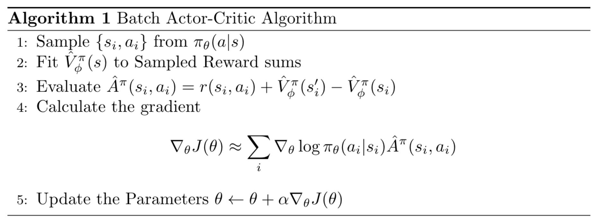
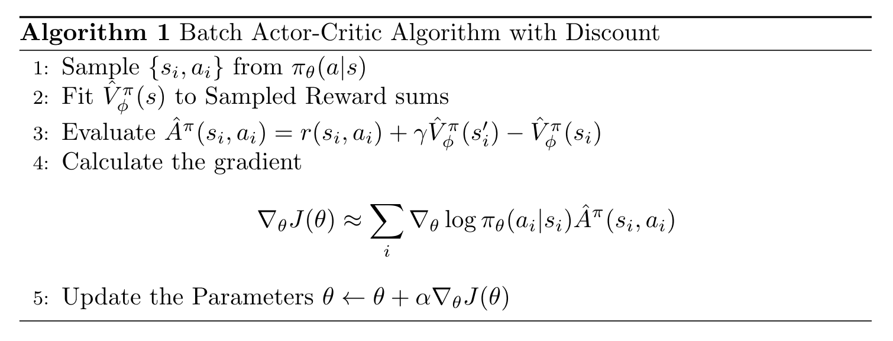
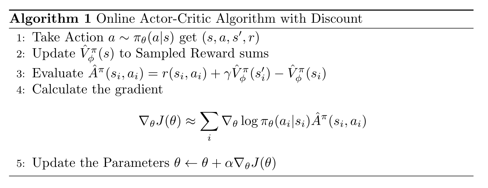

```{r setup, include=FALSE}
knitr::opts_chunk$set(echo = FALSE)
```

## Improving Policy Gradient 

The value $\hat{Q}_{i, t}$ is the estimate of expected reward if we take action $a_{i, t}$ in state $s_{i, t}$. Can we get better estimate ? So, the policy gradient is 

$$
\nabla_{\theta}J(\theta) \approx \frac{1}{N} \sum^N_{i=1} \sum^{T}_{t=1} \nabla_{\theta} \log \pi_{\theta} (a_{i, t} | s_{i, t}) Q(s_{i, t}, a_{i, t})
$$

Where the $Q$ is defined by 

$$
Q(s_t, a_t) = \sum^T_{t'=t} \mathbb{E}[r(s_t, a_t) | s_t, a_t]
$$

We can also add the baseline using the average $Q$ value which is a state value. 

$$
V(s_t) = \mathbb{E}_{a_t \sim \pi_{\theta}(a_t|s_t)}[Q(s_t, a_t)]
$$

We can call the difference between $Q$ and $V$ as an advantage function(telling whether action is better than average or not), where the equation is 

$$
\nabla_{\theta}J(\theta) \approx \frac{1}{N} \sum^N_{i=1} \sum^T_{t=1} \nabla_{\theta}\log \pi_{\theta}(a_{i, t} | s_{i, t}) A^{\pi}(s_{i, t}, a_{i, t})
$$

### Average Function 

The average function is defined by 

$$
A^{\pi}(s_t, a_t) = Q^{\pi}(s_t, a_t) - V^{\pi}(s_t)
$$

The better the estimate, the lower to variance, although the bias is introduced, it is worth-it. We can fit the average function by 

$$
Q^{\pi}(s_t, a_t) = r(s_t, a_t) + \mathbb{E}_{s_{t+1} \sim p(s_{t+1} | s_t, a_t)}  \left[V^{\pi} (s_{t+1})\right] \approx r(s_t, a_t) + V^{\pi}(s_{t+1})
$$

So, now we can estimate the average function, by only fitting the value function 

$$
A^{\pi}(s_t, a_t) = r(s_t, a_t) + V^{\pi}(s_{t+1}) - V^{\pi}(s_t)
$$

---

## Policy Evaluation 

### Monte Carlo Evaluation with Function Approximation 

We can perform the Monte-Carlo policy evaluation (same as Policy Gradient) by fitting. Although, we can use multiple trajectories. 

$$
V^{\pi}(s_t) \approx \frac{1}{N} \sum^N_{i = 1} \sum^T_{t'=t} r(s_{t'}, a_{t'})
$$

One trajector is enought, so the training set is 

$$
\left\{ \left( s_{i, t}, \sum^T_{t'=t} r(s_{i, t'}, a_{i, t'}) \right) \right\}
$$

Using a supervised regression, loss, such as mean-square error 

$$
\mathcal{L} (\phi) = \frac{1}{2} \sum_i  \left|\left| \hat{V}_{\phi}^{\pi}(s_t) - y_i  \right|\right|^2
$$

The same function should fit multiple samples 

### Bootstrapped Estimate 

The ideal target for use would be 

$$
y_{i, t} = \sum^T_{t'=t} \mathbb{E}_{\pi_{\theta}} \left[ r(s_{t'}, a_{t'}) | s_{i, t} \right] \approx r(s_{i, t}, a_{i, t}) + \sum^T_{t'=t+1} \mathbb{E}_{\theta} [r(s_{t'}, a_{t'}) | s_{i, t+1}]
$$

So the target can equal to 

$$
r(s_{i, t}, a_{i, t} ) + V^{\pi}(s_{i, t+1}) \approx r(s_{i, t}, a_{i, t} ) + \hat{V}^{\pi}(s_{i, t+1})
$$

so the training data can be

$$
\left\{ \left( s_{i, t}, r(s_{i, t}, a_{i, t} ) + \hat{V}^{\pi}(s_{i, t+1}) \right) \right\}
$$

And the loss function can be the same. Now we can have the Actor Critic Algorithm

```{r fig.cap="Actor Critic Algorithm in Pseudo-Code", layout="l-body"}
# \begin{algorithm}[H]
#     \caption{Batch Actor-Critic Algorithm}
#     \begin{algorithmic}[1]
#         \State Sample $\{s_i, a_i\}$ from $\pi_{\theta}(a|s)$
#         \State Fit $\hat{V}^{\pi}_{\phi}(s)$ to Sampled Reward sums
#         \State Evaluate $\hat{A}^{\pi}(s_i, a_i) = r(s_i, a_i) + \hat{V}^{\pi}_{\phi}(s'_i) - \hat{V}^{\pi}_{\phi}(s_i)$
#         \State Calculate the gradient 
#         $$
#         \nabla_{\theta}J(\theta) \approx \sum_i \nabla_{\theta}\log \pi_{\theta}(a_i|s_i) \hat{A}^{\pi}(s_i, a_i)
#         $$
#         \State Update the Parameters  $\theta \leftarrow \theta + \alpha \nabla_{\theta}J(\theta)$
#     \end{algorithmic}
# \end{algorithm}

```

### Discount Factor 

The value function will get increasing bound, if the $T$ is infinity, so the value function can get infitely large in many cases. 

Simple trick is to say that it is better to get reward sooner than later, so now the target of the value function can be defined as 

$$
y_{i, t} \approx r(s_{i, t}, a_{i, t}) + \gamma \hat{V}^{\pi}(s_{i, t+1})
$$

Where gamma is the value between 0 and 1. We can also think the discount factor as the probability that we can die any moment. 

__What about Monte Carlo Policy Gradient ?__ 

There are 2 options to add the discount factor to the policy gradient ? 

Option 1:

$$
\nabla_{\theta}J(\theta) \approx \frac{1}{N} \sum^N_{i=1} \left(\sum^T_{t=1} \nabla_{\theta} \log \pi_{\theta} (a_{i, t} | s_{i, t})\right) \left( \sum^T_{t'=t} \gamma^{t'-t}r(s_{i, t'}, a_{i, t'}) \right)
$$

Option 2:

$$
\nabla_{\theta} J(\theta) \approx \frac{1}{N} \sum^N_{i=1}\left(\sum^T_{t=1} \nabla_{\theta} \log \pi_{\theta}(a_{i, t} | s_{i, t}) \right) \left( \sum^T_{t=1} \gamma^{t-1} r(s_{i, t'}, a_{i, t'}) \right)
$$

which are equal to:

For Option 1: 

$$
\nabla_{\theta} J(\theta) \approx \frac{1}{N} \sum^N_{i=1} \sum^T_{t=1} \nabla_{\theta} \log \pi_{\theta} (a_{i, t} | s_{i, t}) \left(\sum^T_{t'=t} \gamma^{t'-1} r(s_{i, t'}, a_{i, t'}) \right)
$$

For Option 2: 

$$
\nabla_{\theta} J(\theta) \approx \frac{1}{N} \sum^N_{i=1} \sum^T_{t=1} \gamma^{t-1} \nabla_{\theta} \log \pi_{\theta} (a_{i, t} | s_{i, t}) \left(\sum^T_{t'=t} \gamma^{t'-1} r(s_{i, t'}, a_{i, t'}) \right)
$$

This means that the later steps matter less. So we want to use option 1 because we should consider graident at every time-steps. 

```{r fig.cap="Batch Actor Critic Algorithm with Discount in Pseudo-Code", layout="l-body"}
# \begin{algorithm}[H]
#     \caption{Batch Actor-Critic Algorithm}
#     \begin{algorithmic}[1]
#         \State Sample $\{s_i, a_i\}$ from $\pi_{\theta}(a|s)$
#         \State Fit $\hat{V}^{\pi}_{\phi}(s)$ to Sampled Reward sums
#         \State Evaluate $\hat{A}^{\pi}(s_i, a_i) = r(s_i, a_i) + \gamma\hat{V}^{\pi}_{\phi}(s'_i) - \hat{V}^{\pi}_{\phi}(s_i)$
#         \State Calculate the gradient 
#         $$
#         \nabla_{\theta}J(\theta) \approx \sum_i \nabla_{\theta}\log \pi_{\theta}(a_i|s_i) \hat{A}^{\pi}(s_i, a_i)
#         $$
#         \State Update the Parameters  $\theta \leftarrow \theta + \alpha \nabla_{\theta}J(\theta)$
#     \end{algorithmic}
# \end{algorithm}

```

```{r fig.cap="Online Actor Critic Algorithm with Discount in Pseudo-Code", layout="l-body"}
# \begin{algorithm}[H]
#     \caption{Online Actor-Critic Algorithm with Discount}
#     \begin{algorithmic}[1]
#         \State Take Action $a \sim \pi_{\theta}(a|s)$ get $(s, a, s', r)$
#         \State Update $\hat{V}^{\pi}_{\phi}(s)$ to Sampled Reward sums
#         \State Evaluate $\hat{A}^{\pi}(s_i, a_i) = r(s_i, a_i) + \gamma \hat{V}^{\pi}_{\phi}(s'_i) - \hat{V}^{\pi}_{\phi}(s_i)$
#         \State Calculate the gradient 
#         $$
#         \nabla_{\theta}J(\theta) \approx \sum_i \nabla_{\theta}\log \pi_{\theta}(a_i|s_i) \hat{A}^{\pi}(s_i, a_i)
#         $$
#         \State Update the Parameters  $\theta \leftarrow \theta + \alpha \nabla_{\theta}J(\theta)$
#     \end{algorithmic}
# \end{algorithm}

```

### Architecture Design 

There are 2 Designs we can take, with variance trade-offs 
  
  * Two Network Design -- It is simple and stable, but there is no shared feature between actor and critics 
  
  * Shared Network Design -- Shared Feature between both actor and critic.

---

## Critic as Baseline/Controlling Variates

### State-Dependent 

Actor Critic (Lower Variance, But Bias)

$$
\nabla_{\theta} J(\theta) \approx \frac{1}{N} \sum^N_{i=1}\sum^T_{t=1} \nabla_{\theta} \log \pi_{\theta}(a_{i, t} | s_{i, t}) \left( r(s_{i, t}, a_{i, t}) + \gamma \hat{V}^{\pi}_{\phi} (s_{i, t+1}) - \hat{V}^{\pi} _{\phi} (s_{i, t})\right)
$$

Polict Gradient (No Biased, But Higher Variance)
$$
\nabla_{\theta}(\theta) \approx \frac{1}{N} \sum^N_{i=1}\sum^{T}_{t=1} \nabla_{\theta} \log \pi_{\theta}(a_{i, t} | s_{i, t})\left(\left( \sum^T_{t'=t} \gamma^{t'-t} r(s_{i, t'}, a_{i, t'}) \right) - b\right)
$$

Can we use value function and still keep the estimator unbiased ? 
$$
\nabla_{\theta} J(\theta) \approx \frac{1}{N} \sum^N_{i=1} \sum^T_{t=1} \nabla_{\theta} \log \pi_{\theta}(a_{i, t} | s_{i, t}) \left(\left( \sum^T_{t'=t} \gamma^{t'-t} r(s_{i, t'}, a_{i, t'}) \right) - \hat{V}^{\pi}_{\phi} (s_{i, t})\right)
$$

### Action Dependent Baseline 

We can have 

$$
\hat{A}(s_t, a_t)= \sum^{\infty}_{t'=t} \gamma^{t'-t} r(s_{t'}, a_{t'}) - Q^{\pi}_{\phi}(s_t, a_t)
$$

This expectation will goes to 0 if the critic is correct, but it isn't want we want. Instead, we got 

$$
\hat{A}(s_t, a_t) = \sum^{\infty}_{t'=t} \gamma^{t'-t}r(s_{t'}, a_{t'}) - V^{\pi}_{\phi}
(s_t)
$$

This is not biased but got high varaince. We can also add the term: 

$$
\begin{aligned}
\nabla_{\theta} J(\theta) \approx &\frac{1}{N} \sum^N_{i=1} \sum^T_{t=1} \nabla_{\theta} \log \pi_{\theta} (a_{i, t} | s_{i, t}) \left( \hat{Q}_{i, t}- Q^{\pi}_{\phi} (s_{i, t}, a_{i, t}) \right) + \\
&\frac{1}{N} \sum^N_{i=1}\sum^T_{t=1} \nabla_{\theta} \mathbb{E}_{a \sim \pi_{\theta}(a_t | s_{i, t})} \left[ Q^{\pi}_{\phi}(s_{i, t}, a_t) \right]
\end{aligned}
$$

to make the unbiased estimate. It is useful when we can calculate the expectation of $Q$ analytically. 

### Eligibility Traces & N-Step Returns 
There are 2 choices for the advantage function.
$$
\hat{A}^{\pi}_C(s_t, a_t) = r(s_t, a_t) + \gamma \hat{V}^{\pi}_\phi(s_{t+1}) - \hat{V}^{\pi}_{\phi}(s_t)
$$

But the bias is high, if the value is wrong (which will always be). Or we can have 

$$
\hat{A}^{\pi}_{MC} (s_t, a_t)= \sum^{\infty}_{t'=t} r(s_{t'}, a_{t'}) - \hat{V}^{\pi}_{\phi}(s_t)
$$

This gives no bias but higher variacne because it is single sample estimate. Can we combine both to control bias/vairance tradeoff ? For examples 

$$
\hat{A}^{\pi}_{n}(s_t, a_t) = \sum^{t+n}_{t'=t} \gamma^{t'-t}r(s_{t'}, a_{t'}) + \gamma^n\hat{V}^{\pi}_{\phi}(s_{t+n}) - \hat{V}^{\pi}_{\phi}(s_t)
$$

Choosing $n>1$ often works better. 

### Generalized Advantage Estimation
Do we have to choose just one $n$ ? Can we cut everywhere all at once. 

$$
\hat{A}^{\pi}_{GAE}(s_t, a_t) = \sum^{\infty}_{n=1} w_n \hat{A}^{\pi}_{n}(s_t, a_t)
$$

The weight can be expressed as 
$$
w_n \propto \lambda^{n-1}
$$

Now the equation is reduced to 
$$
\hat{A}^{\pi}_{GAE}(s_t, a_t) = \sum^{\infty}_{t'=t} (\gamma\lambda)^{t'-t} \delta_{t'} \quad \text{where} \quad \delta_{t'} = r(s_{t'}, a_{t'}) + \gamma\hat{V}
^{\pi}_{\phi} (s_{t+1}) - \hat{V}^{\pi}_{\phi}(s_t)
$$

```{r, echo=FALSE}

htmltools::includeHTML("katex.html")
```

