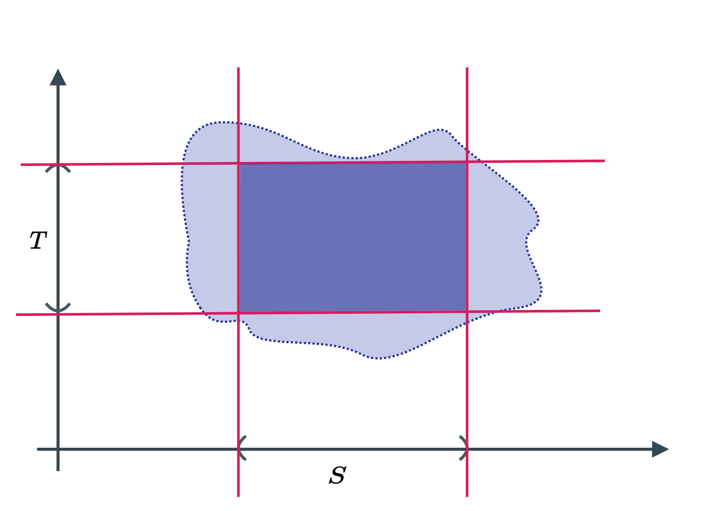

```{r setup, include=FALSE}
knitr::opts_chunk$set(echo = FALSE)
```

## Topology Definition

__Definition__ -- Let $M$ be some set then a choice 

$$
\mathcal{O} \subseteq \mathcal{P}(M)
$$
if called a topology on $M$ if 

  * Empty Set and $M$ are presented in $\mathcal{O}$

$$
\emptyset \in \mathcal{O}, M \in \mathcal{O}
$$

  * The intersection of 2 sets in $\mathcal{O}$ must be in $\mathcal{O}$

$$
u, v \in \mathcal{O} \implies \bigcap \{u,v\} \in \mathcal{O}
$$
 
  * The union of subset $\mathcal{O}$ must be in $\mathcal{O}$ 
  
$$
C \subseteq \mathcal{O} \implies \bigcup C \in \mathcal{O}
$$

__Remark__ -- Unless $|M| = 1$, there are difference topologies $\mathcal{O}$ one can choose on one and the same set. Example of topologies are 

  * Let $M$ be any set and lets its topology be (This is called chaotic topology)
  
  $$
  \mathcal{O} = \{\emptyset, M\}
  $$
  * Let $M$ be any set and let its topology be (This is called discreate topology)

$$
\mathcal{O} = \mathcal{P}(M)  
$$

---

## Standard Topology 

### Definition 

Important topology -- Standard Topology on a set $M$, which is 

$$
M = \mathbb{R}^d = \underbrace{\mathbb{R} \times \mathbb{R} \times \cdots \times \mathbb{R}}_{\text{d times}}
$$

This special topology is written as 

$$
\mathcal{O}_{\text{Standard } \mathbb{R}^d}
$$

And it is constructed in 2 steps

  1. Define an open ball, where 
  
$$
\forall x \in \mathbb{R}^d , \forall r \in \mathbb{R}^+ : B_r^{(2n)}  (x) := \left\{ y \in \mathbb{R}^d \Bigg| \sqrt{\sum^d_{i=1}(y^i - x^i)^{2n}}  < r\right\}
$$

  2. Define a set (open set) that is an element in the standard topology as 

$$
\mathcal{U} \in \mathcal{O}_{\text{Standard } \mathbb{R}^d} :\iff \forall p \in \mathcal{U} :\exists r \in \mathbb{R}^+ : B_r(p) \subseteq \mathcal{U}
$$

### Proof that the Standard Topology is indeed a topology 

We have to check that empty set and $M$ is in the topology 
    
__For empty set__ 
    
$$
\emptyset \in \mathcal{O}_{\text{std}}
$$

Since the definition of for all, is that 
      
$$
\forall p \in \emptyset \iff \forall p : \left(p \in \emptyset \implies \cdots\right)
$$
which will always be true because $p \in \emptyset$ is always false.

__For Set $M$__

It is clear that 

$$
B_r(x) \subseteq M
$$


__Intersection Rule__
Next we have to check that the intersection of 2 sets in $\mathcal{O}$ must be in $\mathcal{O}$. Consider 

$$
p \in U \cap V \implies p \in U \text{ and } p \in V
$$

But, then 

$$
\exists r \in \mathbb{R}^+ : B_r(p) \subseteq U \text{ and } \exists r' \in \mathbb{R}^+ : B_r(p) \subseteq V
$$

And, so 

$$
B_{\min(r, r')}(p) \subseteq P \text{ and } \subseteq V \implies B_{\min(r, r')} \subseteq U \cap V
$$


__Union Rule__
Finally, We have to check that the union of subset has to be in $\mathcal{O}$. Let 

$$
U \in C \subseteq \mathcal{O} \implies \forall p \in U : \exists r \in \mathbb{R}^+ : B_r(p) \subseteq U \subseteq \bigcup C
$$

---

## Constructing of New Topologies from Given Topologies 

### Induced Topology 

__Definition__ -- Let $(M, \mathcal{O})$ be a topological space. Let $N \subseteq M$. Then 

$$
\mathcal{O} |_N = \left\{ U \cap N | U \in \mathcal{O}  \right\} \subseteq \mathcal{P}(M)
$$

is a topology on $N$ called the induced topology. __Proof__ that induced topology is indeed a topology. 

Check that an empty set and $N$ is in the topology 

  1. For an empty set

$$
\emptyset \in \mathcal{O}|_N \text{ since } \emptyset = \emptyset \cap N
$$
  
  2. For a set $N$

$$
N \in \mathcal{O} |_N \text{ since } N = M \cap N
$$

and $M$ is already in the original topology. Check for intersection of 2 sets in the induced topology is in the topology 

$$
\exists U \in \mathcal{O} : S = U \cap N \text{ and } \exists V \in \mathcal{O} : T = V \cap N
$$

Then 

$$
S \cap T = (U \cap N) \cap (V \cap N) = \underbrace{(U \cap V)}_{\in \mathcal{O}} \cap N
$$

Same argument applies to unions. 

__Example of Induced Topology__ -- Given a topology 

$$
(\mathbb{R}, \mathcal{O}_{\text{standard}})
$$

Let a set $N$ be 

$$
N = [-1, 1] = \{x \in \mathbb{R} | -1 \le x \le 1\}
$$

Then the induced topology be 

$$
(N, \mathcal{O}_{\text{st}} |_N)
$$

We claim that  

$$
(0, 1] \not\in \mathcal{O}_{\text{st}} \text{ but } (0, 1] \in \mathcal{O}_{\text{st}} |_N
$$

because 

$$
(0, 1] = (0, 2) \cap [-1, 1]
$$

### Openness & Closeness 

__Definition__ -- Let $(M, \mathcal{O})$ be a topological space. Then $C \subseteq M$ is called closed if 

$$
M \backslash C 
$$

is open. __Example__ -- $[0, 1]$ is cloded in 

$$
(\mathbb{R}, \mathcal{O}_{\text{st}})
$$

because 

$$
\mathbb{R} \backslash [0, 1] = \underbrace{(-\infty, 0) \cup (1, \infty)}_{\text{in } \mathcal{O}_{\text{st}}}
$$

__Common Pitfalls__ -- In general a subset of a topological space can be open and closed and vice versa. 

__Observation__ -- For any topological space 

$$
(M, \mathcal{O})
$$

The empty set $\emptyset = M \backslash M$  is both open and close, while a set $M = M \backslash \emptyset$  is also open and close.

__Real Life Example__ -- Consider a set 

$$
S^1 = \left\{ (x, y) \in \mathbb{R}^2 \Big | x^2 + y^2 = 1 \right\}
$$

One wat to establish a topology on $S$ is to let 

$$
\mathcal{O} = \mathcal{O}_{\text{standard } \mathbb{R}^2}  |_{S^1}
$$

Another way is define $S^1$ as 

$$
S^1 = \mathbb{R} / \sim \text{ where } x \sim y \iff y = x + 2\pi
$$

### Product Topology 

__Definition__ -- Let 2 topological spaces be 

$$
(A, \mathcal{O}_A) \text{ and } (B, \mathcal{O}_B)
$$

Equip $A \times B$ with so-called product topology 

$$
\mathcal{O}_{A \times B}
$$

Defined implicitly by 

$$
U \in \mathcal{O}_{A \times B} \iff \forall p \in U : \exists S \in \mathcal{O}_A , T \in \mathcal{O}_B : S \times T \subseteq U
$$

This can be visualized as 

```{r fig.cap="Product Topology According to definition", layout="l-body"}

```

--- 

## Convergence, Continuity and Homeomorphism

### Convergence 

__Definition__ -- A sequence $q$ (a map)

$$
q : \mathbb{N} \rightarrow M
$$
 
on a topological space. $(M, \mathcal{O})$ is said to converge again a limit point $a \in M$ if

$$
\underbrace{\forall \mathcal{U \in O} \text{ and } a \in \mathcal{U}}_{\text{open neighbbourhood of } a} : \exists N \in \mathbb{N} : \forall n > N : q(n) \in \mathcal{U}
$$
 
__Example__ 

The topological space 

$$
(M , \{\emptyset, M\})
$$

Claim -- Any sequence converge againts every point(only $M$ contains $a$). The topological space 

$$
(M = \mathbb{R}^d, \mathcal{O}_{\text{standard}})
$$

__Theorem__ -- The point converge against a point $a$ if 

$$
\forall \epsilon > 0 : \exists N \in \mathbb{N} : \forall n > N : ||q(n) - a|| < \epsilon
$$

### Continuity 

__Definition__ -- Let 

$$
(M, \mathcal{O}_M) \text{ and } (N, \mathcal{O}_N)
$$

be a topological space, and let

$$
\phi : M \rightarrow N
$$

a map. Then $\phi$ is called continuous if 

$$
\forall V \in \mathcal{O} : \text{pre-im}_{\phi} (V) \in \mathcal{O}_M
$$

__Example__ -- Any map is continuous for 

$$
(M, \mathcal{P}(M)) \text{ and } (N, \{\emptyset, N\})
$$

For standard topology, it recovers standard definition of continuity. 

### Homeomorphism 

__Definition__ -- Let 

$$
\phi : M \rightarrow N
$$

be a bijection. Now equipping 

$$
(M, \mathcal{O}_M) \text{ and } (N, \mathcal{O}_N)
$$

we call $\phi$ a homeomorphism if both the map and its inverse are continuous. 

__Remark__ -- Homeomorphism are the structure preserving maps in topology. 

__Definition__ -- If there exists homeomorphism then it provides a one-to-one pairing of the open set of M with those of N. In case of homeomorphism

$$
(M, \mathcal{O}_M) \cong_{\text{topo}} (N, \mathcal{O}_N) \implies M \cong_{\text{set}} N
$$

```{r, echo=FALSE}
htmltools::includeHTML("katex.html")
```