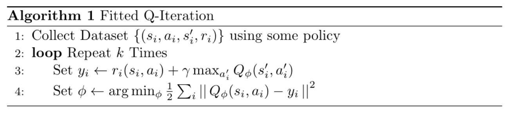
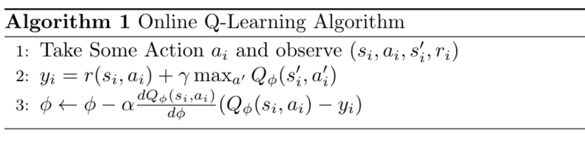
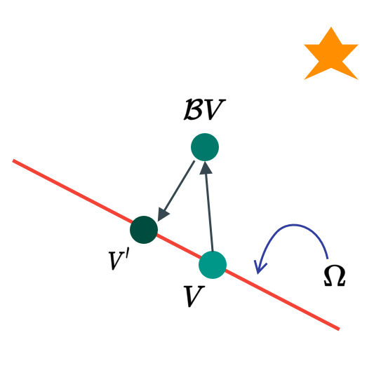

```{r setup, include=FALSE}
knitr::opts_chunk$set(echo = FALSE)
```

## Policy Iteration 

### Can we omit policy graident completely ? 

Since the advantage function 

$$
A^{\pi}(s, a)
$$

means how much better $a_t$ than the average action according to policy $\pi$, so 

$$
\arg\max_{a} A^{\pi} (s_t, a_t)
$$

is the best action from the current state, if we follow $\pi$, and it is at least as good as any 

$$
a_t \sim \pi(a_t|s_t)
$$

regardless of what the policy is, so the new policy should be 

$$
\pi' = \begin{cases} 1 & \text{if } a_t = \arg\max_{a_t}  A^{\pi}(s_t, a_t) \\ 0 & \text{otherwise} \end{cases}
$$

should be as good as $\pi$ and probably better. 

### High Level Idea of Policy Iteration 

Policy Iteration Algorithm

1. Evaluate Advantage function of the current policy 
2. Set the new policy to be 

$$
\pi \leftarrow \pi' \arg\max \text{policy}
$$

as before, we define 

$$
A^{\pi}(s, a) = r(s, a) + \gamma \mathbb{E}\left[ V^{\pi}(s') \right] - V^{\pi}(s)
$$

so why don't we jut evaluate the value function.

### Dynamic Programming

Let's assume we know that 

$$
p(s' | s, a)
$$

and $s$ and $a$ are both discrete and small, where we can store a full value function in a table with a tensor (state_size x state_size x number of actions per state). We can use the bootstrapped update. 

$$
V^{\pi} (s) \leftarrow \mathbb{E}_{a \sim \pi(a|s)} \left[ r(s, a) + \gamma \mathbb{E}_{p(s'|s, a)} \left[V^{\pi}(s') \right] \right]
$$

Then the new policy can be 

$$
\pi'(a_t|s_t) = \begin{cases} 1 & \text{if }  a_t = \arg\max_{a_t} A^{\pi}(s_t, a_t) \\ 0 & \text{otherwise}\end{cases}
$$

It is a deterministic policy, we can simplify the equation by 

$$
V^{\pi}(s) \leftarrow r(s, \pi(s)) + \gamma \mathbb{E}_{s' \sim p(s'|s, a)}\left[V^{\pi}(s')\right]
$$

### Policy Iteration with Dynamic Programming 

1. Evaluate the value function 
2. Set the new policy according to the value function 

Now we can evaluate the policy by 

$$
V^{\pi}(s) \leftarrow r(s, \pi(s)) + \gamma \mathbb{E}_{s' \sim p(s'|s, a)}\left[V^{\pi}(s')\right]
$$

and it is exact with no approximation. 

### Even Simpler Dynamic Programming 

Looking at the advantage function

$$
A^{\pi}(s, a) = r(s, a) + \gamma \mathbb{E}\left[V^{\pi}(s')\right] - V^{\pi}(s)
$$

The _argmax_ of the advantage function is the same as the _argmax_ of Q function 

$$
\arg\max_{a_t} A^{\pi}(s_t, a_t) = \arg\max_{a_t} Q^{\pi} (s_t, a_T)
$$

where $Q$ function is 

$$
Q^{\pi}(s, a) = r(s, a) + \gamma \mathbb{E} \left[V^{\pi}(s')\right]
$$

Then the new value iteration algorithm is 
  
  1. Set 

$$
Q^{\pi}(s, a) = r(s, a) + \gamma \mathbb{E}\left[V^{\pi}(s')\right]
$$

  2. And the Set 
  
$$
V(s) \leftarrow \max_a Q(s, a)
$$

--- 

## Fittend Value Iteration

How can we represent $V(s)$ ? it is a curse of dimensionality problem. We can use a neural network as a function of 

$$
V : S \rightarrow \mathbb{R}
$$

The fitted value iteration, algorithm is 

  1. Set
  
$$
y_i \leftarrow \max_{a_i} \left(r(s_i, a_i) + \gamma \mathbb{E}\left[ V_{\phi}  (s_i')\right]\right)
$$

  2. Set 
  
$$
\phi \rightarrow \arg\min_{\phi} \frac{1}{2} \left|\left| V_{\phi}(s_i) - y_i \right|\right|^2
$$

### If we don't know the dynamic 

Then we need a new policy iteration. 

1. Evaluate the $Q(s, a)$ as a function
2. Set the policy ot a new one according to the function 

We are not going to use the value function but, instead using a Q function 

$$
r(s, a) + \gamma \mathbb{E}_{s' \sim p(s' | s, \pi(s))} \left[Q^{\pi}(s', \pi'(s))\right]
$$

now we can do the max trick again, Now the fitted Q iteration algorithm becomes 

1. Set 

$$
y_i \leftarrow r(s_i, a_i) + \gamma \max_{a'} Q_{\phi}(s'_i, a_i')
$$

2. Set 

$$
\phi \leftarrow \arg\max_{\phi} \sum_i \frac{1}{2} \left|\left|Q_{\phi}(s_i, a_i) - y_i \right|\right|^2
$$

It works for off-policy samples, need only 1 network but there is no convergence guarantees. 

```{r fig.cap="Fitted Q-Iteration Algorithm", layout="l-body"}

# \begin{algorithm}[H]
#     \caption{Online Q-Learning Algorithm}
#     \begin{algorithmic}[1]
#         \State Collect Dataset $\left\{(s_i, a_i, s_i', r_i)\right\}$ using some policy
#         \Loop{ Repeat $k$ Times}
# 
#             \State Set $y_i \leftarrow r_i(s_i, a_i) + \gamma \max_{a'_i}Q_{\phi}(s_i', a_i')$
# 
#             \State Set $\phi \leftarrow \arg\min_{\phi}\frac{1}{2}\sum_i \left|\right| Q_{\phi}(s_i, a_i) - y_i \left|\right|^2$
# 
#         \EndLoop
# 
#     \end{algorithmic}
# \end{algorithm}

```

It is off-policy because $s$, are independent of the policy. The _max_ improves the policy in tabular case. We define the error $\epsilon$ by 

$$
\mathcal{E}  = \frac{1}{2} \mathbb{E}_{(s, a) \sim \beta} \left[ Q_{\phi} - \left[r(s, a) + \gamma \max_{a'} Q_{\phi}(s', a')\right] \right]
$$

If the error is zero then 

$$
Q_{\phi} = r(s, a) + \gamma \max_{a'}Q_{\phi}(s', a')
$$

This is an optimal Q-function corresponding to optimal policy $\pi'$. 

```{r fig.cap="Online Q-Iteration Algorithm", layout="l-body"}

# \begin{algorithm}[H]
#     \caption{Online Q-Learning Algorithm}
#     \begin{algorithmic}[1]
#         \State Take Some Action $a_i$ and observe $(s_i, a_i, s_i', r_i)$
#         \State $y_i = r(s_i, a_i) + \gamma \max_{a'} Q_{\phi}(s'_i, a'_i)$
#         \State $\phi \leftarrow \phi- \alpha\frac{dQ_{\phi}(s_i, a_i)}{d\phi}(Q_{\phi}(s_i, a_i)- y_i) $
#     \end{algorithmic}
# \end{algorithm}
```

### Exploration with Q Learning 

Since the final policy 

$$
\pi(a|s) = \begin{cases} 1 & \text{if } a_t = \arg\max_{a_t} Q_{\phi}(s_t, a_t) \\ 0 & \text{otherwise} \end{cases}
$$

will likely getting stuck due to exploitation, there are various strategies for the agent to explore for example, an epsilon greedy 

$$
\pi(a|s)= \begin{cases} 1-\epsilon \text{ if } a_t = \arg\max_{a_t} Q_{\phi}(s_t, a_t) \\  \epsilon / (|A| - 1)  \text{ otherwise} \end{cases}
$$

Or Boltzmann Exploration 

$$
\pi(a|s) \propto \exp \left(Q_{\phi}(s_t, a_t)\right) 
$$

---

## Value Function Learning Theory

Value Iteration Algorithm

1. Set 

$$
Q(s, a) \leftarrow r(s, a) + \gamma \mathbb{E}\left[V(s')\right]
$$

2. Set 

$$
V(s) \leftarrow \max_a Q(s, a)
$$

### Does it converge ? 

Define an operator, where it is 

$$
\mathcal{B}V = \max_{a} r_a + \gamma \mathcal{T}_a V 
$$

where $\mathcal{T}$ is the matrix of transition for action such that 

$$
\mathcal{T}_{a, i, j} = P(s' = i | s= j, a)
$$

We say that $V^*$ is a fixed point of $B$, when 

$$
V^*(s) = r(s, a) + \gamma \mathbb{E}\left[ V^*(s) \right], \text{ so } V^* = \mathcal{B}V^*
$$

It is always exists, is always unique, always corresponds to the optimal policy. We can prove that value iteration reaches $V^*$ because $\mathcal{B}$  is a contraction map. 

$$
\left|\left| \mathcal{B}V - \mathcal{B}\bar{V} \right|\right|_{\infty} \le \gamma \left|\left| V - \bar{V} \right|\right|_{\infty}
$$

Gaps always gets smaller by gamma with respect to infinity norm. What if we choose $V^*$

$$
\left|\left| \mathcal{B}V - V^* \right|\right|_{\infty} \le \gamma \left|\left| V - V^* \right|\right|_{\infty}
$$


```{r fig.cap="Illustrate with this picture(Inspired by In-Slide Figure)", layout="l-body"}
knitr::include_graphics("Images/Figure3.png")
```


### Non-Tabular Value Function Learning 

For the normal value iteration algorithm, it can we written as 

$$
V \leftarrow \mathcal{B}V
$$

For a fitted value iteration algorithm, it can be written as 

$$
V \leftarrow \Pi\mathcal{B}V
$$

Where $\Pi$ is the new operator 

$$
\Pi V = \arg\min_{V'\in \Omega} \frac{1}{2} \sum \left|\left| V'(s) - V(s) \right|\right|^2
$$

so we can iterpreted $\Pi$ as a projection on $Omega$ (in term of l2 norm)

We can show that $\Pi$ is also a contraction map with respect to l2-norm.

$$
\left|\left| \Pi V - \Pi \bar{V} \right|\right|_2 \le \gamma \left|\left| V - \bar{V} \right|\right|_2
$$

But when both map combine, they are not a contraction map of any kind. 

```{r fig.cap="Illustrate of Contraction Map(Inspired by In-Slide Figure)", layout="l-body"}

```

Conclusion -- The value iteration converges, while fitted value iteration doesn't converge, not in general sense and often not in practice.

### What about Q-Iterations ? 

Define a new operation 

$$
\mathcal{B}Q = r + \gamma \mathcal{T}\max_{a} Q 
$$

Define an opeation $\pi$ as 

$$
\Pi Q = \arg\max_{Q' \in \Omega} \frac{1}{2} \sum \left|\left| Q'(s, a) - Q(s, a) \right|\right|^2
$$

Same argument. Isn't it just a regression ? 

$$
\phi \leftarrow \phi \frac{dQ_{\phi}(s_i, a_i)}{d\phi} \left( Q_{\phi} (s_i, a_i) - \left[ r(s_i, a_i) + \gamma \max_{a'} Q_{\phi}(s'_i, a'_i) \right] \right)
$$

There is no gradient through target value. Q learning is not gradient descent. 

__Sad Corollary__ -- Fitted Bootstrapped policy evaluation doesn't converge.

```{r, echo=FALSE}
htmltools::includeHTML("katex.html")
```