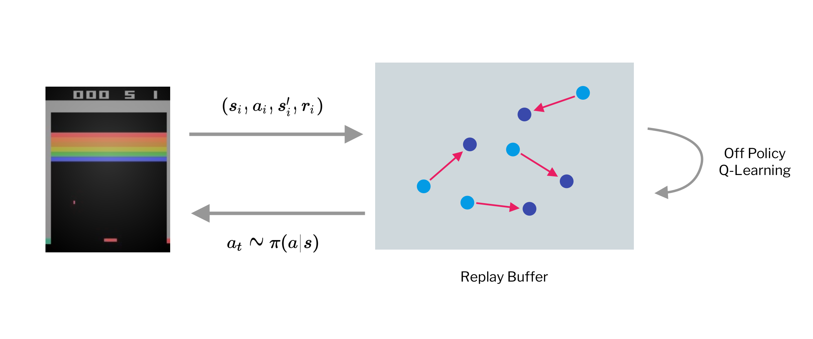
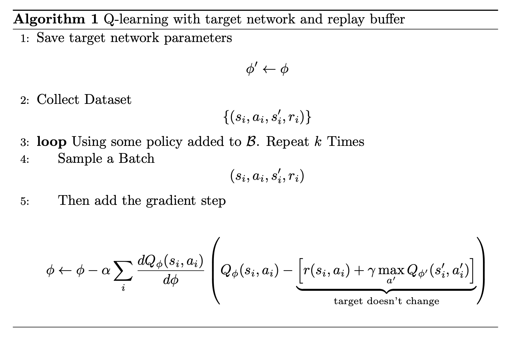
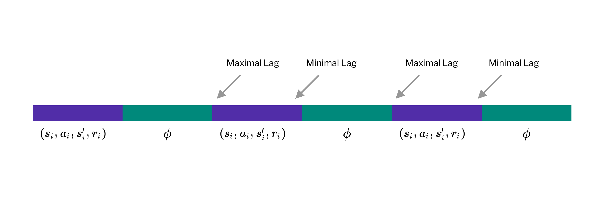
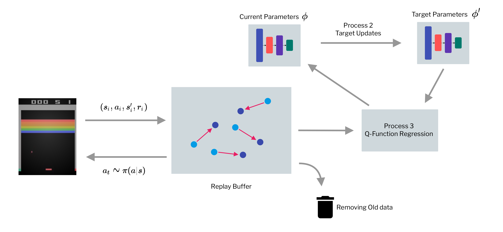
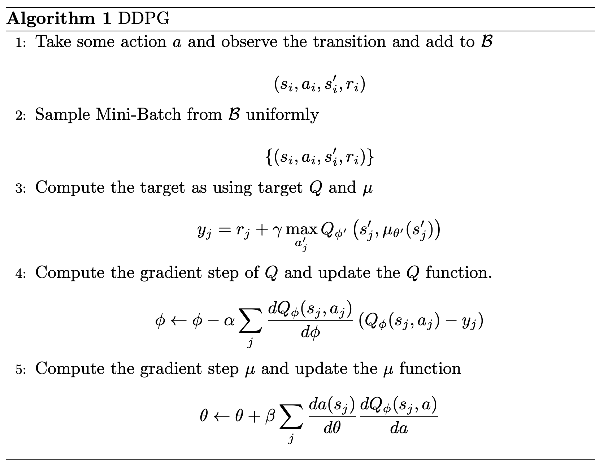

```{r setup, include=FALSE}
knitr::opts_chunk$set(echo = FALSE)
```

## What is wrong and the solutions.

### What is wrong ?

Q-Learning isn't gradient descent 

$$
\phi \leftarrow \phi - \alpha\frac{dQ_{\phi}(s_i, a_i)}{d\phi} \left( Q_{\phi}(s_i, a_i) - \underbrace{\left[r(s_i, a_i) + \gamma \max_{a'} Q_{\phi}(s'_i, a'_i)\right]}_{\text{No gradient Through Target Value}}  \right)
$$

The gradient step correlated with data, which break neural network assumption where we assume that all batches are not correlated. 

And if the target is always changing, we will get the local area instead of the whole function. 

We can solve it by parallel the process, so we get difference samples, but it can be hard when we got a physical system, such as Robot and Server Farm

### Replay Buffer 

Exploit the fact that the Q-Value Algorithm is off-policy. The original algorithm would be 

1. Sample a batch 

$$
(s_i, a_i, s_i', r_i) \sim \mathcal{B}
$$

2. Update the parameter by 

$$
\phi \leftarrow \phi - \alpha \sum_i \frac{dQ_{\phi}(s_i, a_i)}{d\phi} \left( Q_{\phi}(s_i, a_i) - \left[r(s_i, a_i) + \gamma \max_{a'} Q_{\phi} (s'_i, a'_i)\right] \right)
$$

Now we can have multiple samples, so now the are not correlated. And we can get multiple samples from batches. The data comes from replay buffer.

```{r fig.cap="Visualization of Replay Buffers", layout="l-body"}

```

__Full Q Learning with Replay Buffer__ 

* Collect data set 

$$
\{(s_i, a_i, s'_i, r_i)\}
$$

  Using Some policy added to $\mathcal{B}$ Then repeat K times 
  
  * Sample a Batch 
  
$$
(s_i, a_i, s'_i, r_i)
$$

  * Then add the gradient step 
  
$$
\phi \leftarrow \phi - \alpha \sum_i \frac{dQ_{\phi}(s_i, a_i)}{d\phi} \left(Q_{\phi}(s_i, a_i) - \left[ r(s_i, a_i) + \gamma \max_{a'} Q_{\phi} (s'_i, a'_i)\right]\right)
$$

Then there are still moving step, so we need a fixed target network. 

```{r fig.cap="DQN algorithm"}

# \begin{algorithm}[H]
#     \caption{Q-learning with target network and replay buffer }
#     \begin{algorithmic}[1]
#         \State Take some action $a$ and observe the transition and add to $\mathcal{B}$
#         $$
#         (s_i, a_i, s'_i, r_i)
#         $$
#         \State Sample Mini-Batch from $\mathcal{B}$ uniformly 
#         $$
#         \{(s_i, a_i, s'_i, r_i)\}
#         $$
#         \State Compute the target as using target $Q$ and $\mu$
#         $$
#         y_j = r_j + \gamma \max_{a'_j}Q_{\phi'}\left( s'_j, \mu_{\theta'}(s'_j) \right)
#         $$
#         \State Compute the gradient step of $Q$ and update the $Q$ function. 
#         $$
#         \phi \leftarrow \phi - \alpha \sum_j \frac{dQ_{\phi}(s_j, a_j}{d\phi} \left( Q_{\phi}(s_j, a_j)- y_j \right)
#         $$
#         \State Compute the gradient step $\mu$ and update the $\mu$ function 
#         $$
#         \theta \leftarrow \theta + \beta \sum_j \frac{da(s_j)}{d\theta} \frac{dQ_{\phi}(s_j, a)}{da} 
#         $$
#     \end{algorithmic}
# \end{algorithm}
```

The update the uneven due to the change of target network. Can be visualized as 

```{r fig.cap="Seeing the Lag (Inspired by in-slide figure)"}

```

Instead of just update the parameters of the target network, we can simply interpolate 

$$
\phi' \leftarrow \tau\phi'  + (1-\tau)\phi
$$

where $\tau = 0.999$ works well.

### The more general view 

```{r fig.cap="General Process of Value Learning"}

```

* Online Q-Learning -- Moves immediately, data collection process, target network update and Q-Function regression runs at the same speed. 

* DQN -- Data Collection process and Q-Function refression run at the same speed, while target update is slow.

* Fitted Q-Iteration -- Q-function regression runs in the inner loop of target network update, which is in the loop of data collection process. 

---

## Improving Q-Learning 

### Are the Q-Values accurates ? 

As predicted Q increase, so does the return, and it anticipate the reward in the future. Actually, DQN is higher than it anticipated. 

It is because the target value of DQN 

$$
y_j = r_j + \gamma \underbrace{\max_{a'_j} Q_{\phi}(s'_j)}_{\text{Problem}}
$$

Imagine we have 2 random variables $x_1$ and $x_2$ 

$$
\mathbb{E}[\max(x_1, x_2)] \ge \max\left(\mathbb{E}[x_1], \mathbb{E}[x_2] \right)
$$

This amplify the mean and noise, and since the approximation of the target value isn't accurate, this will gives out the overestimated value. Fix this by making the noise decorated. 

First Noted that 

$$
\max_{a'} Q_{\phi'}(s_j', a_j')  = Q_{\phi'}(s'_j, \arg\max_{a'}Q_{\phi'}(s'_j, a'_j))
$$

__Double Q-Learning__ We can have 2 updates for 2 networks 

$$
\begin{aligned}
Q_{\phi_A}(s, a) &\leftarrow r + \gamma Q_{\phi_B}\left( s', \arg\max_{a'} Q_{\phi_A}  (s', a')\right) \\ 
Q_{\phi_B}(s, a) &\leftarrow r + \gamma Q_{\phi_A}\left( s', \arg\max_{a'} Q_{\phi_B}(s', a') \right)
\end{aligned}
$$

But instead we can use the current and target network 

$$
y = r + \gamma Q_{\phi'}\left( s'_j, \arg\max_{a'} Q_{\phi}(s'_j, a'_j) \right)
$$

### Multi-Step Returns 

The normal Q-Learning target 

$$
y_{j, t} = r_{j, t} + \gamma \max_{a_j, t+1} Q_{\phi'}(s_{j, t+1}, a_{j, t+1})
$$

The reward at the moment is the only values that matter if estimated Q value is biased. The Q value estimation is important if it good. 

Q-Learning gives maximum bias, but minimum variance. We can construct multi-step return by 

$$
y_{j, t} = \sum^{t' + N - 1}_{t'=t} r_{j, t'} + \gamma^N \max_{a_j, t+N}Q_{\phi}(s_{j, t+N}, a_{j, t+N})
$$

This is called N-Step return estimators 

  * It is less biased target value when Q value are inaccurate 
  
  * Typically faster learning 
  
  * But, only correct when the learning on-policy, since the policy depends on Q-Function. 
  
Where $y$ suppose to estimate $Q^{\pi}(s_{j, t} , a_{j, t})$

We need a transtion to come from the current policy 

$$
(s_{j, t'}, a_{j, t'}, s_{j, t'+1}) \text{ where } t'-t < N-1
$$

This might be a problem, so there are some ways to fix. 

* Ignore the problem, which might give a pretty good result. 

* Cut the trace -- dynamically choose N to get only on-policy data

  * Works well when data is mostly on-policy, and action space is smaller. (hope to get near on-policy data)
  
* Important Sampling 

---

## Q-Learning With Continuous Actions 

The problem with continuous action is to find the maximum of the Q-value. How do we perform the max ? We can do optimization instead. 

* SGD ? -- It is slow in inner step. 
* Action Space have to be typically low-dimension (stochastic optimization)

### Q-Learning with Stochastic Optimization 

The Simple Solution 

$$
\max_a Q(s, a) \approx \{Q(s, a_1), \cdots , Q(s, a_N)\}
$$

Where 

$$
(a_1, ..., a_N)
$$

are sampled from some distribution. The pros and cons are 

* Pros -- Dead simple, effectively parallelizable. 
* Cons -- Not accurate. 

We can have more accurate solutions, which are 

* Cross-Entropy Methods 
* CMA-ES

### Easily Maximizable Q-Functions 

We can use function class that is easy to optimize, which can be a quadratic form. 

$$
Q_{\phi}(s,a) = -\frac{1}{2} \left( a - \mu_{\phi}(s) \right)^T P_{\phi}(s) (a - \mu_{\phi}(s)) + V_{\phi}(s)
$$

We called it normalized advantage functions 

$$
\begin{aligned}
\arg\max_{a} Q_{\phi}(s, a) &= \mu_{\phi}(s) \\
\max_a Q_{\phi}(s, a) &= V_{\phi}(s)
\end{aligned}
$$

The pros and cons are 

* There is no change to algorithm
* Just as efficient as Q-Learning 
* Losses its representation power. 

### Learn an Approximate Maximizer

DDPG (Deterministic Actor Critic)

$$
\max_a Q_{\phi} (s, a) = Q_{\phi}\left( s, \arg\max_{a} Q_{\phi}(s, a) \right)
$$
Train another network such that 

$$
\mu_{\theta} (s) \approx \arg\max_{a} Q_{\phi}(s, a)
$$

We can juse solve 

$$
\theta \leftarrow \arg\max_{\theta} Q_{\phi}(s, \mu_{\theta} )
$$

where the gradient is 

$$
\frac{dQ_{\phi}}{d\theta} = \frac{da}{d\theta} \frac{dQ_{\phi}}{da}
$$

The new target is that 

$$
y_j = r_j + \gamma \max_{a'_j} Q_{\phi'}\left( s'_j , \mu_\theta(s'_j) \right)
$$

__The algorithm is__

```{r fig.cap="DDPG algorithm"}

# \begin{algorithm}[H]
#     \caption{DDPG}
#     \begin{algorithmic}[1]
#         \State Take some action $a$ and observe the transition and add to $\mathcal{B}$
#         $$
#         (s_i, a_i, s'_i, r_i)
#         $$
#         \State Sample Mini-Batch from $\mathcal{B}$ uniformly 
#         $$
#         \{(s_i, a_i, s'_i, r_i)\}
#         $$
#         \State Compute the target as using target $Q$ and $\mu$
#         $$
#         y_j = r_j + \gamma \max_{a'_j}Q_{\phi'}\left( s'_j, \mu_{\theta'}(s'_j) \right)
#         $$
#         \State Compute the gradient step of $Q$ and update the $Q$ function. 
#         $$
#         \phi \leftarrow \phi - \alpha \sum_j \frac{dQ_{\phi}(s_j, a_j)}{d\phi} \left( Q_{\phi}(s_j, a_j)- y_j \right)
#         $$
#         \State Compute the gradient step $\mu$ and update the $\mu$ function 
#         $$
#         \theta \leftarrow \theta + \beta \sum_j \frac{da(s_j)}{d\theta} \frac{dQ_{\phi}(s_j, a)}{da} 
#         $$
#     \end{algorithmic}
# \end{algorithm}
```

---

## Simple Practical Tips for Q-Learning 

* Q-Learning takes some care to stablized 
  
  * Test on easy reliable task first, make sure you implementation is correct 
  
* Large replay buffers helps improves stability -- Took more like fitted Q-iteration 

* It takes time, be patient. 

* Starts with high exploration. 

* Bellman Error Gradient can be big, you can clip gradient or use Huber Loss

$$
L(x) = \begin{cases} x^2/2 &\text{if } |x| \le \delta \\  \delta |x| - \delta^2/2 & \text{otherwise}\end{cases}
$$

* Double Q-Learning helps a lot in practice. 

* N-Step returns also help a lot but have some downsides.

* Schedule exploration, and learning rate decay, also Adams helps too 

* Run multiple random seed, it's very inconsistent between runs.

```{r, echo=FALSE}
htmltools::includeHTML("katex.html")
```

