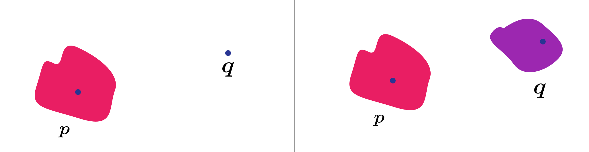

```{r setup, include=FALSE}
knitr::opts_chunk$set(echo = FALSE)
```

## Seperation Properties 

__Definition__ -- Topological Space 

$$
(M, \mathcal{O})
$$

is called T1 if any 2 distict points, 

$$
p \ne q, \exists \mathcal{U} \in \mathcal{O} : p \in \mathcal{U} \wedge q \not\in \mathcal{U}
$$

__Definition__ -- Topological Space 

$$
(M, \mathcal{O})
$$

is called T2 (Hausdorff) if for 2 distinct points, 

$$
p \ne q , \exists \mathcal{U} \in \mathcal{O} , \mathcal{V} \in \mathcal{O} : p \in \mathcal{U} , q \in \mathcal{V} : \mathcal{U} \cap V = \emptyset
$$

Intuitively, we can visualized it as. 

```{r fig.cap="Diagram for T1 and T2 in order", layout="l-body-outset"}


```

__Example__ -- For

$$
(\mathbb{R}^d, \mathcal{O}_{\text{standard } \mathbb{R}^d})
$$

is T2, which implies T1. while, Zariski-Topology (algebraic geometry) is T1 but not T2, and For 

$$
\left(M, \{M, \emptyset\} \right)
$$

is T2 and not even T1. 

---

## Compactness & Para-Compactness 

__Definition__ -- A topological space 

$$
(M, \mathcal{O})
$$

is called compact if every open-cover $C$ are a finite sub-cover. 

__Definition__ -- Open Cover 

$$
C \subseteq \mathcal{O} \text{ is open cover if } \bigcup C = M 
$$

__Definition__ -- Finite Sub-Cover is a cover such that 

$$
\tilde{C} \subseteq C
$$

and it is finite. 

__Definition__ -- A subset $N \subseteq M$ is called compact if 

$$
(N, \mathcal{O}|_N)
$$

is compact. 

__Theorem (Heine-Borel)__ -- In a metric space 

$$
(M, d)
$$

Equipped with the metric induced topology. Every closed and bounded subset is compact. 

__Definition__ -- Metric is a map 

$$
d : M \times M \rightarrow \mathbb{R}^+
$$

such that

$$
\begin{aligned} d(m,n) &= d(n,m) \\ d(m, n) &\ge 0 \\ d(a, b) + d(b, c) &\ge d(a, c)  \end{aligned}
$$


__Definition__ -- Metric induced topology, similar defined as standard topology, but 

$$
B_r(p) = \left\{ q | d(p, q) < r \right\}
$$

__Example__ 

1. This is compact 

$$
[0, 1]
$$

2. The real line is not compact  $\mathbb{R}$.

<aside>
 We can construct a cover that has not finite sub-covers.
where if you can't take any sub-cover out without 
</aside>

__Theorem__ -- For 2 topological spaces 

$$
(M, \mathcal{O}_M) , (N, \mathcal{O}_N)
$$

are topological space. Then, 

$$
(M \times N, \mathcal{O}_{M \times N})
$$

is also compact. 

### Paracompact 

__Definition__ -- A topological space 

$$
(M, \mathcal{O}_M)
$$

is called paracompact if every open-cover has an open refinement that is locally finite. 

__Definition__ -- Open Refinement is an open-cover such that 

$$
\forall \mathcal{U} \in C : \exists \tilde{\mathcal{U}} \in \tilde{C} : \tilde{\mathcal{U}} \subseteq \mathcal{U}
$$

__Definition__ -- Locally finite 

$$
\forall p \in M : \exists \mathcal{U} \in \mathcal{O} \text{ such that } \mathcal{U} \cap \tilde{\mathcal{U}} \ne \emptyset
$$

only for finitely many 

$$
\tilde{\mathcal{U}} \in \tilde{C}
$$

__Corollary__ -- Compact implies Paracompact. 

__Theorem__ -- Every metricable topology is paramcompact. For example, 

$$
(\mathbb{R}, \mathcal{O}_{\text{st}})
$$

Alexandrov long line (not paracompact). The idea is that 

$$
\mathbb{R} = \mathbb{Z} \times [0, 1)
$$
This is paracompact. However, for a long line, 

$$
L = w_1 \times [0, 1) \text{ where } w \text{ is no countable set.}
$$

is not paracompact. 

__Theorem__ -- if 

$$
(M, \mathcal{O}_M)
$$

is paracompact and 

$$
(N, \mathcal{O}_N)
$$

is compact, then 

$$
(M \times N, \mathcal{O}_{M \times N})
$$

is paracompact. 

__Corollary__ -- We can use that to contruct a paracompact topology.

$$
\underbrace{M \times \underbrace{N_1 \times N_2 \times ... \times N_f}_{\text{Compact}}}_{\text{Paracompact}}
$$

__Theorem__ -- Let 

$$
(M , \mathcal{O})
$$


```{r, echo=FALSE}
htmltools::includeHTML("katex.html")
```