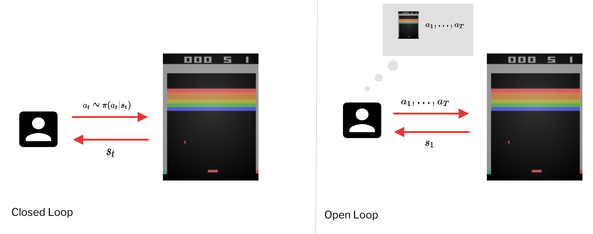
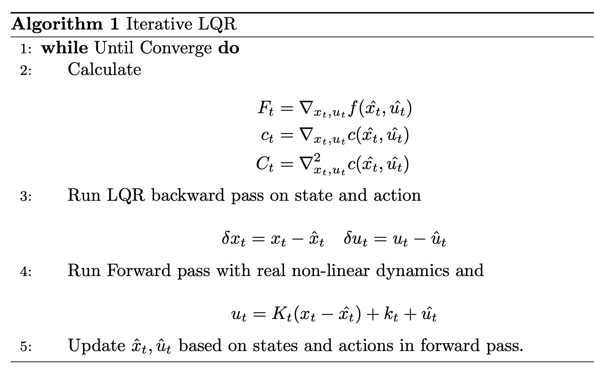

```{r setup, include=FALSE}
knitr::opts_chunk$set(echo = FALSE)
```

## Model Based Reinforcement Learning 

### What if we knew the transition dynamics ? 

Often we know the transition dynamics ? 

  1. Game 
  
  2. Easily Modeled system 
  
  3. Simulated Environment.
  
Often we can learn the dynamics 

  1. System identification -- Fit unknown parameter of a known model 
  2. Learning -- Fit general purpose model to observed transition data. 
  
Now we can 

  * Learn transition dynamics, then figure out how to choose actions.
  
  * Now - How can we make decision if we knew dynamics ?
  
    * How can we choose actions under perfect knowledge of the system perference. 
    
    * Optimum Control, trajectory optimization planning
    
### The Objective 

$$
\min_{a_1, ..., a_r} \sum^T_{t=1} c(s_t, a_t) \text{ such that } s_t = f(s_{t-1}, a_{t-1})
$$

__The Deterministic Case__

$$
a_1, ..., a_T = \arg\max_{a_1, ..., a_T} \sum^T_{t=1} r(s_t, a_t) \text{ such that } a_{t+1} = f(s_t, a_t)
$$

__The Stochastic Open-Loop Case__ 

$$
\begin{aligned} 
p_{\theta}(s_1,...,s_T|a_1, ....,a_T) &= p(s_1) \prod^T_{t=1} p(s_{t+1}|s_t, a_t) \\ 
a_1, ..., a_T &= \arg\max_{a_1,...,a_T} \mathbb{E}\left[ \sum_t  r(s_t, a_t) \bigg| a_1, ..., a_T\right]
\end{aligned}
$$

However this is suboptimal because if we commited to the sequence of actions, then we can't change eventhrough the result of action is shown duing the actions. 

```{r fig.cap="Closed-Loop Control and Open-Loop Control"}

```

__The Stochastic Closed-Loop__

$$
\begin{aligned} 
\pi &= \arg\max_{\pi} \mathbb{E} \left[ \sum_t r(s_t, a_t) \right] \\ 
p(s_1, a_t, ..., s_T, a_T) &= p(s_1) \cdot \prod^T_{t=1} \pi(a_t|s_t) p(s_{t+1}|s_t, a_t)
\end{aligned}
$$

---

## Stochastic Optimization 

We abstract away optimial control/planning

$$
a_1, ..., a_T = \arg\max_{a_1, ..., a_T} J(a_1, ..., a_T)
$$

Simple Method -- Guess and Check (Random Shooting Method)

  * Choose from some distribution 

$$
A_1, ..., A_N
$$
  * Choose $A_i$ based on 
  
$$
\arg\max_{i} J(A_i)
$$

### Cross-Entropy Methods 

  1. Pick Some sequence from some distribution

$$
A_1, ..., A_N \sim P(A)
$$

  2. Evaluate 
  
$$
J(A_1), ..., J(A_N)
$$

  3. Pick Elites 
  
$$
A_{i_1} , ..., A_{i_M} \text{ where } M < N
$$

  4. Refit $P(A)$ to elites 

We typically use a guassian distribution, where we can add momemtum to it, so that it becomes _CMA-ES_, where the pros and cons are 
  
  * Pro -- Fast if parallelized 
  * Pro -- Simple 
  * Con -- Hash Dimensionality Limit 
  * Con -- Open Loop Planning
  
### Discreate Case -- Monte-Carlo Tree Search 

The policy at the end can be random policy. We can't search all paths, so we choose node with best reward, but also prefer rarely visited nodes.

__Genertic MCTS__

  1.Find a leaf $s_l$ using $\text{TreePolicy}(s_1)$ 
  
  2.Evaluate the leaf using $\text{DefaultPolicy}(s_l)$ 
  
  3. Update all the values between $s_1$ to $s_l$
  
We can then take best action from $s_1$. The $\text{TreePolicy}(s_t)$ can be 
  
  * If $s_t$ is not fully expanded -- choose a new $a_t$
  
  * Else choose child with the score 

$$
\text{score}(s_t) = \frac{Q(s_t)}{N(s_t)} + 2 c \sqrt{\frac{2\ln N(s_{t-1})}{N(s_t)}}
$$  

__Imitation Learning from MCTS with DAgger__ 

1. Train $\pi_{\theta}(u_t|o_t)$ from human data 

$$
\mathcal{D} = \{o_1, u_1, ..., o_N, u_N\}
$$

2. Run the policy to get the dataset 

$$
\mathcal{D}_{\theta} = \{o_1, ..., o_M\}
$$

3. Choose action from state policy dataset using MCTS. 

4. Adding both dataset together 

$$
\mathcal{D} \leftarrow \mathcal{D} \cup \mathcal{D}_{\pi}
$$

we train Policy using MCTS becase MCTS is too slow for real time policy and training might gives us better generalization, perceptions, etc...

---

## Using Derivatives. 

$$
\begin{aligned}
\min_{u_1,..., u_T} \sum^T_{t=1} c(x_t, u_t) \text{ such that } x_t = f(x_{t-1}, u_{t-1}) \\ 
\min_{u_1,...,u_T} c(x_1, u_1) + c(f(x_1, u_1), u_2) + ... + c(f(f(...)...), u_T)
\end{aligned}
$$

We might use back-propagation and optimize the code, which mean we needs 

$$
\frac{df}{dx_t}, \frac{df}{du_t} , \frac{dc}{dx_t}, \frac{dc}{du_t}
$$

However, in practice, it is really helping to add second order method, because the very first action has enormous effect, which is either exploding or vanishing gradients. 

There are 2 ways we can optimize the loss, either optimize over the actions only (Shooting Method)

$$
\min_{u_1,...,u_T} c(x_1, u_1) + c(f(x_1, u_1), u_2) + ... + c(f(f(...)...), u_T)
$$

or optimized over action and state with contraints

$$
\min_{u_1, ..., u_T, x_1, ..., x_T} \sum^T_{t=1} c(x_t, u_t) \text{ such that } x_t = f(x_{t-1}, u_{t-1})
$$

### Linear Case -- LQR

We assume that 

$$
\begin{aligned}
f(x_t, u_t) &= F_t \begin{bmatrix}x_t \\ u_t\end{bmatrix} + f_t \\
c(x_t, u_t) &= \frac{1}{2} \begin{bmatrix}x_t \\ u_t\end{bmatrix}^T C_T \begin{bmatrix}x_t \\ u_t\end{bmatrix} + \begin{bmatrix}x_t \\ u_t\end{bmatrix}^Tc_t
\end{aligned}
$$

__Base Case__ -- We will solve for the final action only. 

$$
\min_{u_1,...u_T} c(x_1, u_1) + c(f(x_1, u_1), u_2) + ... + \underbrace{c(f(f(...)...), u_T)}_{\text{only term that depends on } u_T}
$$

Where now the cost becomes 

$$
Q(x_T, u_T) = \text{const} + \frac{1}{2} \begin{bmatrix}x_T \\ u_T\end{bmatrix}^T C_T \begin{bmatrix}x_T \\ u_T\end{bmatrix} + \begin{bmatrix}x_T \\ u_T\end{bmatrix}^T c_T
$$ 

where 

$$
C_T = \begin{bmatrix}C_{x_T, x_T} & C_{x_T, u_T} \\ C_{u_T, x_T} & C_{u_T, u_T}\end{bmatrix} \text{ and } c_T = \begin{bmatrix}c_{x_T} \\ c_{u_T}\end{bmatrix}
$$

Then the derivative is (then set to zero)

$$
\nabla_{u_T} Q(x_T, u_T) = C_{u_T, x_T} x_T + C_{u_T, u_T} u_T + c_{u_T}^T = 0
$$

Therefore the final action is equal to 

$$
u_T = K_Tx_T + k_T \quad \text{ where } K_T = -C^{-1}_{u_T, u_T}C_{u_T,x_T} \text{ and } k_t = -C^{-1}
_{u_T, u_T} c_{u_T}
$$

Since the final action is fully determined by final state, we can eliminate via subtitution (on the cost). 

$$
V(x_T) = \text{const} + \frac{1}{2} \begin{bmatrix}x_T \\ K_Tx_T+k_t\end{bmatrix}^T C_T \begin{bmatrix}x_T \\ K_Tx_T + k_T\end{bmatrix} + \begin{bmatrix}x_T \\ K_Tx_T + k_T\end{bmatrix}^Tc_T
$$

We can expand, so we got 

$$
V(x_T) = \text{const} + \frac{1}{2}x^T_T V_Tx_T + x^T_Tv_T
$$

where 

$$
\begin{aligned}
V_t &= C_{x_T, x_T} + C_{x_T,u_T} K_T + K_T^T C_{u_T, x_T} + K^T_TC_{u_T, u_T} K_T \\
v_t &= c_{x_T} + C_{x_T, u_T} k_T + K^T_T C_{u_T} + K^T_T C_{u_T, u_T}k_T
\end{aligned}
$$

Now we solve $u_{T-1}$ in terms of $x_{T-1}$.

$$
\begin{aligned}
u_{T-1} \text{ affects } x_T &= F_{T-1} \begin{bmatrix}x_{T-1} \\ u_{T-1}\end{bmatrix} + f_{T-1} \\ 
Q(x_{T-1}, u_{T-1}) &= \text{const} + \frac{1}{2} \begin{bmatrix}x_{T-1} \\ u_{T-1}\end{bmatrix}^T C_{T-1} \begin{bmatrix}x_{T-1} \\ u_{T-1}\end{bmatrix} + \begin{bmatrix}x_{T-1} \\ u_{T-1}\end{bmatrix}^T c_{T-1} + \underbrace{V(f(x_{T-1}, u_{T-1}))}_{V(x_T)}
\end{aligned}
$$

Where we expand the term $V(f(x_{T-1}, u_{T-1}))$ to be 

$$
V(x_T) = \text{const} + \frac{1}{2} \begin{bmatrix}x_{T-1} \\ u_{T-1}\end{bmatrix}^T \underbrace{F^T_{T-1} V_T F_{T-1}}_{\text{Quadratic}} \begin{bmatrix}x_{T-1} \\ u_{T-1}\end{bmatrix} +\begin{bmatrix}x_{T-1} \\ u_{T-1}\end{bmatrix}^T \underbrace{F^T_{T-1}V_Tf_{T-1}}_{\text{Linear}} + \begin{bmatrix}x_{T-1} \\ u_{T-1}\end{bmatrix}^T \underbrace{F^T_{T-1}v_T}_{\text{Linear}}
$$

Now the Q function is equal to 

$$
Q(x_{T-1}, u_{T-1}) = \text{const} + \frac{1}{2}\begin{bmatrix}x_{T-1} \\ u_{T-1}\end{bmatrix}^T Q_{T-1} \begin{bmatrix}x_{T-1} \\ u_{T-1}\end{bmatrix} + \begin{bmatrix}x_{T-1} \\ u_{T-1}\end{bmatrix}^T q_{T-1}
$$

Where 

$$
Q_{T-1} = C_{T-1} + F^T_{T-1} V_T F_{T-1} \quad \text{ and } \quad q_{T-1} = c_{T-1} + F^T_{T-1}V_Tf_{T-1} + F^T_{T-1}v_T
$$

Taking the derivative of to optimize the Q function 

$$
\nabla_{u_{T-1}} Q(x_{T-1}, u_{T-1}) = Q_{u_{T-1}, x_{T-1}}x_{T-1} + Q_{u_{T-1}, u_{T-1}}u_{T-1} + q^T_{u_{T-1}} = 0
$$

Then the solution is 

$$
u_{T-1} = K_{T-1}x_{T-1} + k_{T-1} \text{ where } K_{T-1} = - Q^{-1}_{u_{T-1}, u_{T-1}}Q_{u_{T-1}, x_{T-1}}k_{T-1} = -Q^{-1}_{u_T}q_{u_{T-1}}
$$

__Algorithm(Backward Recursion)__

$$
\begin{aligned}
\text{For } t = &T \text{ to } 1 \\
Q_t &= C_t + F^T_tV_{t+1}F_t \\ 
q_t &= c_t + F^T_tV_{t+1}f_t + F^T_tv_{t+1} \\ 
Q(x_t, u_t) &= \text{const} + \frac{1}{2} \begin{bmatrix}x_t \\ u_t\end{bmatrix}^T Q_t \begin{bmatrix}x_t \\ u_t\end{bmatrix} + \begin{bmatrix}x_t \\ u_t\end{bmatrix}^Tq_t \quad  \text{ (Cost from now until the End)} \\
u_t &\leftarrow \arg\min_{u_t} Q(x_t, u_t) = K_tx_t + k_t \\
K_t &= -Q_{u_t, u_t}^{-1}Q_{u_t, x_t} \quad k_t = Q_{u_t, u_t}^{-1}q_{u_t} \\ 
V_t &= Q_{x_t, x_t} + Q_{x_t, u_t}K^T_t Q_{u_t, x_t} + K^T_t Q_{u_t, u_t}  K_t \\ 
v_t &= q_{x_t} + Q_{x_t, u_t}k_t + K^T_t Q_{u_t} + K^T_t Q_{u_t, u_t} k_t \\
V(x_T) &= \text{const} + \frac{1}{2} x^T_t V_t x_t + x^T_t v_T
\end{aligned}
$$

__Algorithm(Forward Recursion)__

$$
\begin{aligned}
\text{For } t = &T \text{ to } 1 \\
u_t &=K_tx_t + k_t \\ 
x_{t+1} &= f(x_t, u_t)
\end{aligned}
$$

__Stochastic Dynamics__ 
$$
\begin{aligned}
f(x_t, u_t) &= F_t \begin{bmatrix}x_t \\ u_t\end{bmatrix} + f_t \\
x_{t+1} \sim p(x_{t+1}|x_t, u_t) &= \mathcal{N}\left(F_t \begin{bmatrix}x_t \\ u_t\end{bmatrix} + f_t\right)
\end{aligned}
$$

Solution is to ignore because Gaussian is symmetric.

### Non-Linear Case -- DDP/Iterative LQR 

Can we approximate a non-linear system system as a linear-quadratic system 

$$
\begin{aligned}
f(x_t, u_t) &\approx f(\hat{x}_t, \hat{u}_t) + \nabla_{x_t, u_t} f(\hat{x}_t, \hat{u}_t) \begin{bmatrix}x_t- \hat{x}_t\\ u_t-\hat{u}_t\end{bmatrix} \\ 
c(x_t, u_t) &\approx c(\hat{x}_t, \hat{u}_t) + \nabla_{x_t, u_t} c(\hat{x}_t, \hat{u}_t) \begin{bmatrix}x_t- \hat{x}_t\\ u_t-\hat{u}_t\end{bmatrix} + \frac{1}{2} \begin{bmatrix}x_t- \hat{x}_t\\ u_t-\hat{u}_t\end{bmatrix}^T\nabla_{x_t,u_t}^2 c(\hat{x}_t, \hat{u}_t) \begin{bmatrix}x_t- \hat{x}_t\\ u_t-\hat{u}_t\end{bmatrix}
\end{aligned}
$$

So we change the equation to be

$$
\begin{aligned}
\bar{f}(\delta x_t, \delta u_t) &= F_t \begin{bmatrix}\delta x_t\\ \delta u_t\end{bmatrix} \quad \text{ where } F_t = \nabla_{x_t, u_t} f(\hat{x}_t, \hat{u}_t) \\ 
\bar{c}(\delta x_t, \delta u_t) &=  \frac{1}{2} \begin{bmatrix}\delta x_t\\ \delta u_t\end{bmatrix}^T C_t \begin{bmatrix}\delta x_t\\ \delta u_t\end{bmatrix} + \begin{bmatrix}\delta x_t\\ \delta u_t\end{bmatrix}^T c_t \quad \text{where } C_t =  \nabla^2_{x_t, u_t} c(\hat{x}_t, \hat{u}_t), c_t = \nabla_{x_t, u_t} c(\hat{x}_t, \hat{u}_t)
\end{aligned}
$$

And 

$$
\delta x_t = x_t - \hat{x}_t \quad \delta u_t = u_t - \hat{u}_t
$$

```{r fig.cap="Iterative LQR Algorithm"}

# \begin{algorithm}[H]
#     \caption{Iterative LQR}
#     \begin{algorithmic}[1]
#         \While{Until Converge}
#             \State Calculate     
#             $$
#             \begin{aligned}
#                 F_t &= \nabla_{x_t, u_t} f(\hat{x_t}, \hat{u_t}) \\
#                 c_t &= \nabla_{x_t, u_t} c(\hat{x_t}, \hat{u_t}) \\ 
#                 C_t &= \nabla^2_{x_t, u_t} c(\hat{x_t}, \hat{u_t}) 
#             \end{aligned}
#             $$
#             \State Run LQR backward pass on state and action 
#             $$
#             \delta x_{t} = x_t - \hat{x}_t \quad \delta u_t  = u_t - \hat{u}_t
#             $$
#             \State For Forward pass with real non-linear dynamics and 
#             $$
#             u_t = K_t(x_t - \hat{x_t}) + k_t + \hat{u_t}
#             $$
#             \State Update $\hat{x}_t, \hat{u}_t$ based on states and actions in forward pass.
#         \EndWhile
#     \end{algorithmic}
# \end{algorithm}
```

It works because it has the same idea as the Newton's Method, which locally approximate a complext non-linear function using Taylor expansion (iLQR is an approximation of Newton's method)

$$
\hat{x} \leftarrow \arg\min_{x} \frac{1}{2} (x-\hat{x})^T \nabla^2_{x} g(\hat{x}) (x-\hat{x}) + (\nabla_xg(\hat{x}))^T(x-\hat{x})
$$

To be exact you will have to introduce second order dynamic approximation. (Hard to compute)

Directly solving for minimimun can causes error due to the bad second order approximation. 

Therefore we can introduce $\alpha$ term to interpolate between new and old trajectory. 

$$
u_t = K_t(x_t - \hat{x_t}) + \alpha k_t + \hat{u_t}
$$

and to get the best value.

```{r, echo=FALSE}
htmltools::includeHTML("katex.html")
```