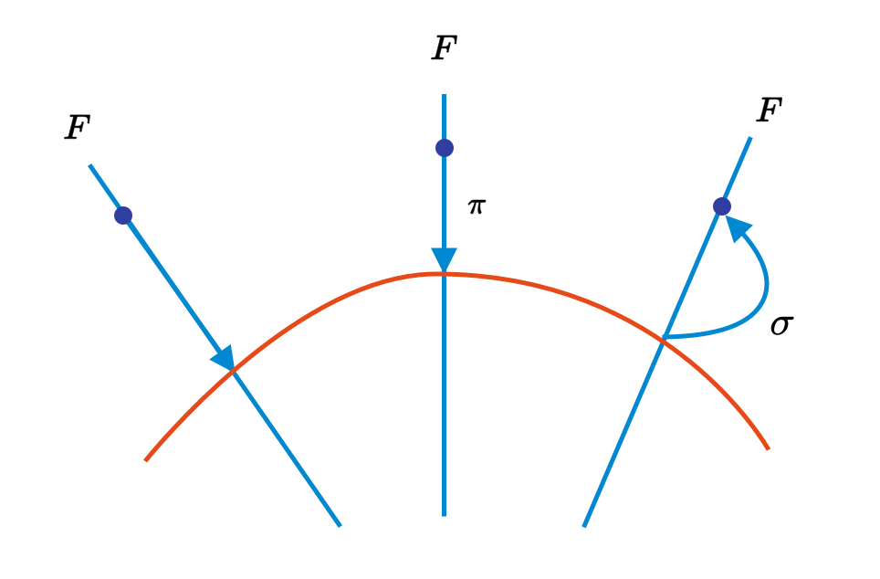
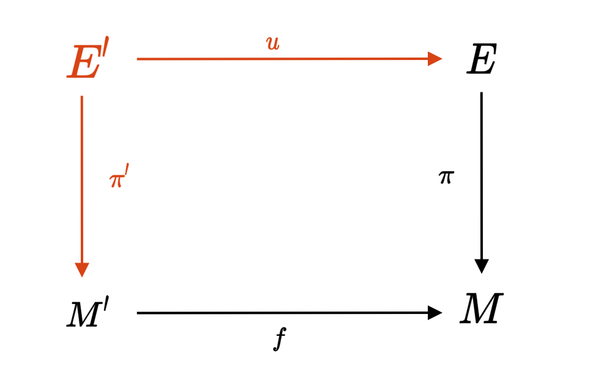
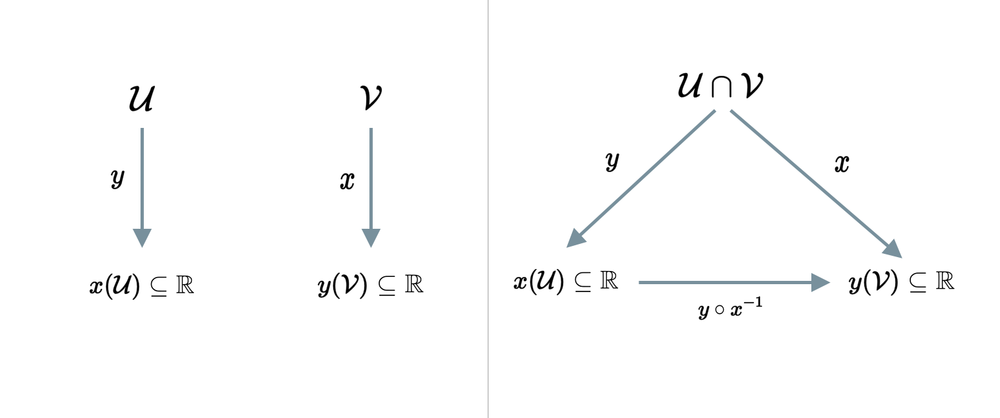
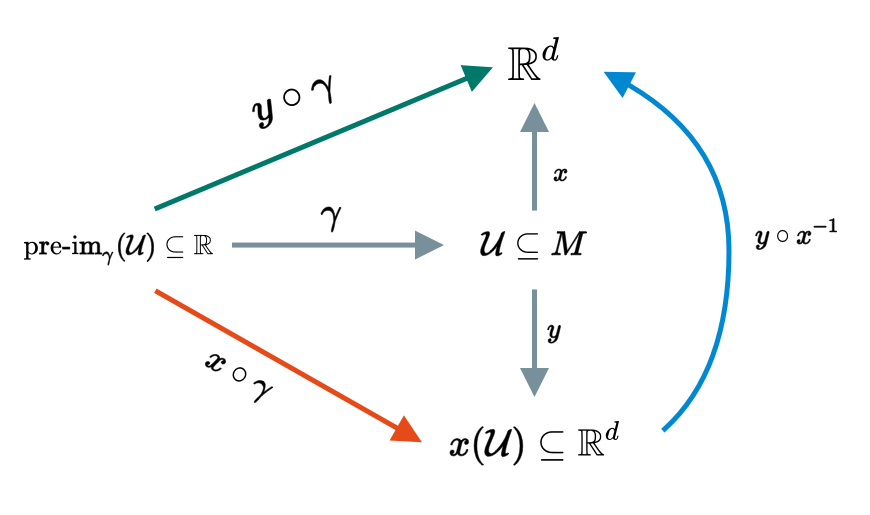

```{r setup, include=FALSE}
knitr::opts_chunk$set(echo = FALSE)
```

## Topological Manifold 

__Definition(Shorten Version)__ -- It is a topological space that locally looks like 

$$
\mathbb{R}^d
$$

__Definition(Formal)__  -- A paracompact Haudoff topological space 

$$
(M, \mathcal{O})
$$

is called a d-dimensional (topological) manifold if for every points $p \in M$. There exists 

$$
p \in \mathcal{U} \in \mathcal{O}
$$

and a homeomorphic 

$$
x : \mathcal{U} \rightarrow x(\mathcal{U}) \subseteq \mathbb{R}^d
$$

### Contruct New from Old 

__Definition__ Let $(M, \mathcal{O})$ be a topological manifold, and $N \subseteq M$. we call 

$$
(N, \mathcal{O}|_N)
$$
sub-manifold if it is a manifold in its own right.

__Definition__ -- Let 2 topological manifold be 

$$
(M, \mathcal{O}_M) \text{ and } (N, \mathcal{O}_N)
$$

Then 

$$
(M \times N, \mathcal{O}_{M \times N})
$$

is a topological manifolds of dimensions 

$$
\dim(M) + \dim(N)
$$

called the product mainfold. 

--- 

## Bundles

__Definition__ -- Bundle of topological manifold is a triple 

$$
(E, \pi, M)
$$

Where 
  
  * $E$ is a topological manifold called total space 
  * $\pi$ is a continuous surjective map 

$$
\pi : E \rightarrow M
$$


  * $M$ is a topological manifold called base space. 
  
We let, $p \in M$ Then 

$$
\text{pre-im}_{\pi}(\{p\}) = F_p \text{ ("Fibre out of point p")}
$$

__Example__ 

1. Let $M$ and $F$ be a topological manifold. Define a total space to be 

$$
E = M \times F 
$$

Then the map can be (can continuous)

$$
\pi : M \times F \rightarrow M \text{ where } (p, f) \mapsto p
$$

There is not assumption that total space contructed bt base space, so it is generalized version of project. 

```{r fig.cap="Diagram example of Bundle", layout="l-body-outset"}
knitr::include_graphics("Images/Figure1.png")
```

The pre-images are 

$$
\begin{aligned}
\text{pre-im}(\{p\}) &= S^1 = F_p \\ 
\text{pre-im}(\{q\}) &= \{\cdot\} = F_q \\
\text{pre-im}(\{r\}) &= (0, 1) = F_r
\end{aligned}
$$

__Definition__ -- Let 

$$
E \xrightarrow{\pi} M
$$

be a bundle such that 

$$
\forall p \in M : \text{pre-im}_{\pi}(\{p\}) \cong F
$$

Then the bundle is called Fibre bundly with typical fibre $F$.

__Definition__ -- Let 

$$
E \xrightarrow{\pi} M 
$$
be a bundle. A map 

$$
\sigma : M \rightarrow E
$$

is called section of the bundle if 

$$
\pi \circ \sigma = \text{id}_M
$$

```{r fig.cap="Diagram example of Section", layout="l-body-outset"}

```

__Special Case__ -- Let the final space be 

$$
E = M \times F
$$

and 

$$
\pi = \text{proj}_1
$$

This bundle is called product bundle, where only in this case, a section is defiend as 

$$
\sigma : M \rightarrow E \quad p \mapsto (p, s(p))
$$

where $s$ is a map 

$$
s : M \rightarrow F
$$

__Definition__ -- Let 

$$
E \xrightarrow{\pi} M 
$$

is a bundle, and 

$$
E' \xrightarrow{\pi'} M'
$$

be a sub-bundle if 

$$
E' \subseteq E \text{ and } M' \subseteq M \text{ and } \pi |_{E'} = M'
$$

__Definition__ -- Let 

$$
E \xrightarrow{\pi} M 
$$

be a bundle and let $N \subseteq M$ be a sub-manifold then 

$$
\text{preim}_{\pi}(N)  \xrightarrow[\pi|_{\text{preim}_{\pi}(N)}]{} N
$$

is called restricted bundle.


__Definition__ -- Two bundles 

$$
E \xrightarrow{\pi} M \text { and } E' \xrightarrow{\pi'} M' 
$$

and maps 

$$
u : E \rightarrow E' \text{ and } f: M \rightarrow M'
$$

Then $(u, f)$ is called bundle morphism if 

```{r fig.cap="Commutative Diagram for Bundle Morphism", layout="l-body-outset"}

```

It is commute

$$
\pi' \circ u = f \circ \pi
$$

__Definition__ -- 2 bundles

$$
E \xrightarrow{\pi} M \text{ and } E' \xrightarrow{\pi'} M'
$$

are called isomorphic as bundle if there exists bundle morphism 

$$
(u, f) \text{ and } (u', f')
$$

```{r fig.cap="Commutative Diagram for Bundle isomorphism", layout="l-body-outset"}

```

Such $(u, f)$ are called bundle isomorphism, they are clearly a relevant structuring-perserving maps for bundles.

__Definition__ -- A bundle 

$$
E \xrightarrow{\pi} M 
$$

is called locally isomorphic for another bundle 

$$
E' \xrightarrow{\pi'} M'
$$

if for every $p\in M$ there exists $p \in \mathcal{U}\in \mathcal{O}$ The restricted bundle.
 
$$
\text{pre-im}_{\pi}(\mathcal{U}) \xrightarrow[\pi|_{\text{preim}_{\pi}(\mathcal{U})}]{} \mathcal{U}
$$

is isomorphic to another bundle $E' \xrightarrow{\pi'} M'$. (Think of it as only some part of the bundle that isomorphic)

__Terminology__ 

* A bundle 

$$
E \xrightarrow{\pi} M
$$

is called trivial if its isomorphic to a product bundle. 

$$
M \times N \xrightarrow{\pi} M
$$

* A bundle is called locally trivial if it is locally isomorphic to some product bundles.

From now on, we are going to consider locally trivial bundle, where any section can be prepresented as a map from a base space to fibre.


__Definition__ -- Let 

```{r fig.cap="Commutative Diagram for Pull-Back bundle, Orage color shows where the definition is used", layout="l-body-outset"}

```

be a bundle, we can construct the pull-back bundle as. 

$$
E' = \left\{ (m', e) \in M' \times E | \pi(e) = f(m') \right\}
$$

where the map is define as 

$$
\pi'(m', e) = m' \text{ and } u(m', e) = e
$$

__Remark__ -- Sections on a bundle pull-back to the pull-back bundle can be calculated too.

---

## Viewing Manifolds from atlases

__Defintion__ -- Let $(M, \mathcal{O})$ be a topological manifold of dimension $d$. The pair 

$$
(\mathcal{U}, x)
$$

where 

$$
\mathcal{U} \in \mathcal{O} \text{ and } x : \mathcal{U} \rightarrow x(\mathcal{U}) \subseteq \mathbb{R}^d
$$

is called a chart of manifold. The component functions of $x$, can be defined as 

$$
x^i : \mathcal{U} \rightarrow \mathbb{R} \quad p \mapsto \text{proj}_j(x(p))
$$

are then called to coordinate of the point p with respect to a char $(\mathcal{U}, x)$. 

__Remark__ -- Obviously, there exists a set of charts $A$ such that 

$$
\bigcup_{(\mathcal{U}, x) \in \mathcal{A}} \mathcal{U} = M
$$

and the charts that have non-empty overlap $\mathcal{A}$ is called atlases.

__Definition__ -- 2 Charts 

$$
(\mathcal{U}, x) \text{ and } (\mathcal{V}, y)
$$

are called C0-Compatible if either $\mathcal{U} \cap \mathcal{V} = \emptyset$
 or if both charts

```{r fig.cap="Charts before and After", layout="l-body-outset"}

```

and 

$$
\mathcal{U} \cap \mathcal{V} \ne \emptyset 
$$

and the map 

$$
y \circ x^{-1}
$$

is continuous as a map from 

$$
\mathbb{R}^d \rightarrow \mathbb{R}^d
$$

It applies to every charts, where the map $y \circ x^{-1}$ is called the coordinate changing map.

__Definition__ -- A c0-atlas $\mathcal{A}$ is an atlas whose charts are pair-wise c0-compatible. (Obviously any atlash is c0-atlas.)

__Definition__ -- An atlas is called maximal if any charts 

$$
(\mathcal{U}, x)
$$

that is c0-compatible with any $(\mathcal{V}, y) \in \mathcal{A}$ is already contained in atlas. 

__Remark__ -- Consider 

$$
(M, \mathcal{O}) = (\mathbb{R}, \mathcal{O}_s)
$$

Then 

$$
\mathcal{A} = \{(\mathbb{R}, \text{id}_{\mathbb{R}})\}
$$

is an atlast, while 

$$
\mathcal{A} = \{(\mathbb{R}, \text{id}_{\mathbb{R}}), ((-\infty, 0), \text{id}_{\mathbb{R}})\}
$$

is also atlas. We can add more and more charts, then when we finally add everything it becomes. $\mathcal{A}_{\max}$.

### Looking an Manifold

Consider a curve $\gamma$ that is continuous as if the tarjectory of classical particle.

$$
\gamma : \mathbb{R} \rightarrow M
$$

The real curve is gamma, but we see as in chosen coordinate system. if we change the system, it acts the same as change of chart with continuous map.

```{r fig.cap="Charts before and After", layout="l-body-outset"}

```

if we know the chart transition map $(y \circ x^{-1})$, we can forgot the inner-working of the world. If we would like to talk about differentiablility, we will have to impose the transition function to preserving the properties, and resticted atlast, and ....


```{r, echo=FALSE}
htmltools::includeHTML("katex.html")
```