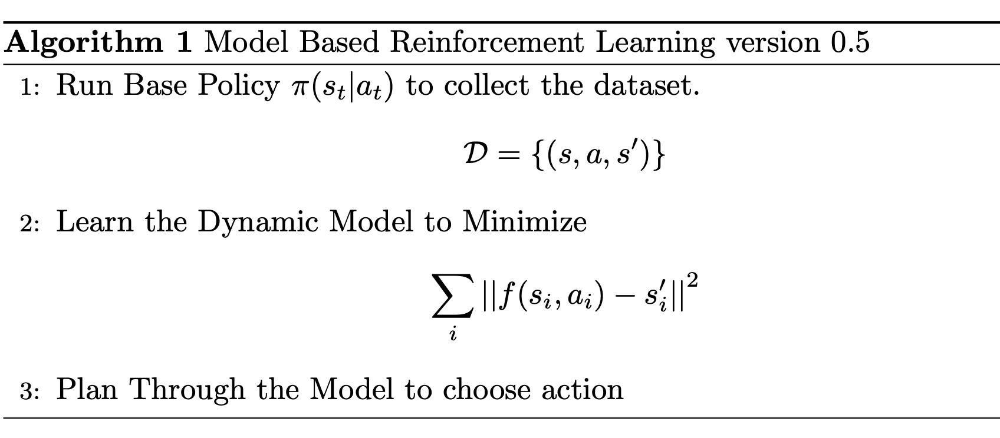
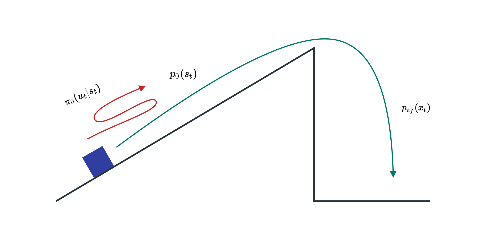
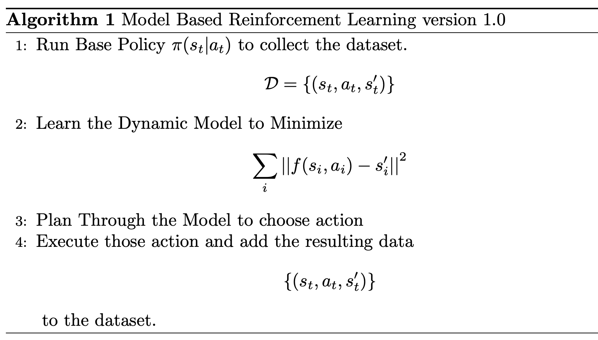
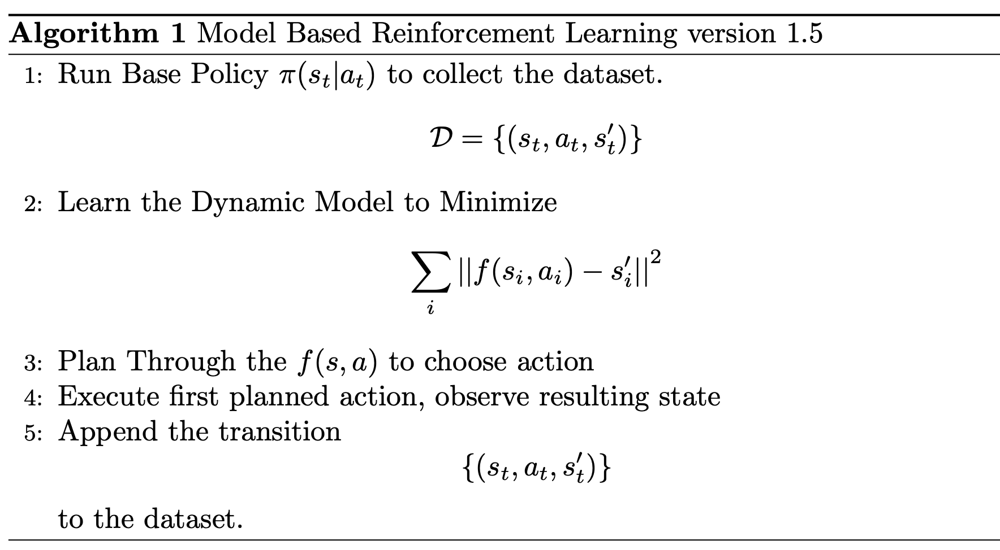
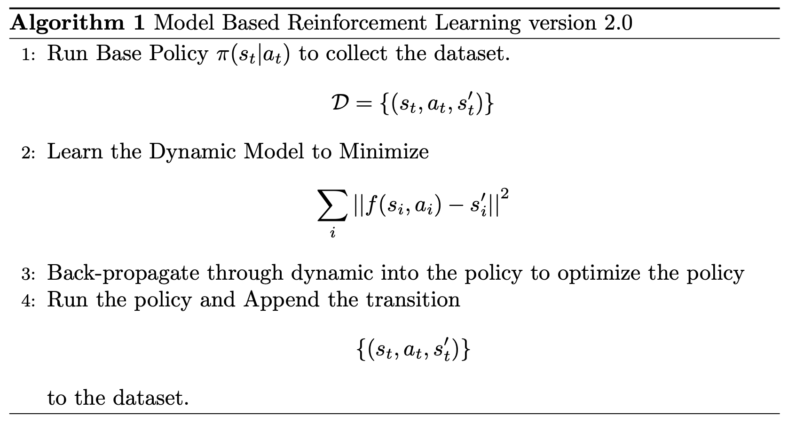
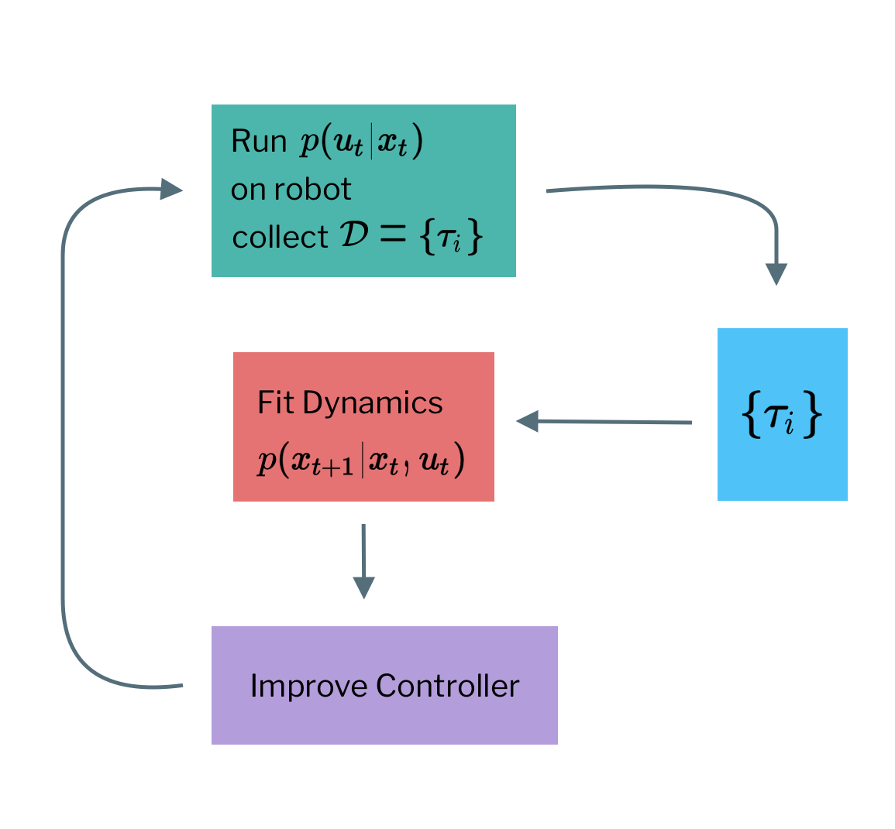

```{r setup, include=FALSE}
knitr::opts_chunk$set(echo = FALSE)
```

## Learning Models 

If we know the dynamic 

$$
f(s_t, a_t) = s_{t+1}
$$

we could use the tool from last time to plan the new action. 

### Model Based Reinforcement Learning version 0.5

```{r fig.cap="Version 0.5"}

# \begin{algorithm}[H]
#     \caption{Model Based Reinforcement Learning version 0.5}
#     \begin{algorithmic}[1]
#         \State Run Base Policy $\pi(s_t|a_t)$ to collect the dataset.
#         $$
#         \mathcal{D} = \{(s, a,s')\}
#         $$
#         \State Learn the Dynamic Model to Minimize 
#         $$
#         \sum_i \left|\left| f(s_i, a_i) - s'_i \right|\right|^2
#         $$
#         \State Plan Through the Model to choose action
#     \end{algorithmic}
# \end{algorithm}
```

__Does it work ? (Yes)__ 

  * It is how system identification works in classical robotics.
  
  * Some care should be takedn to design a good base policy 
  
  * Effective if we can hand-engineer a dynamic representation using our knowledge of physics and fit just parameters. 

__Does it work? (No)__

```{r fig.cap="Distribution Mismatch (Inspired from In-Slide Figure)"}

```

Given this scenario, if we want to have an agent that reaches the peak. we can collect some data. 

However the model going to assume that as you go more to the right, you elevation will be higher, which isn't 100% correct since it will make the robot jump off the cliff at some point.

The problem is that we collect the data from difference distribution. We first collect from 

$$
\pi_0(a_t|s_t)
$$
but we see 

$$
p_{\pi_f}(x_t)
$$

The distribution mismatch problem becomes exacerbated as we use more expressive model classes. 

### Model Based Reinforcement Learning version 1.0 and 1.5

Can we make 

$$
p_{\pi_f}(s_t) = p_{\pi_0}(s_t)
$$

```{r fig.cap="Version 1.0"}

# \begin{algorithm}[H]
#     \caption{Model Based Reinforcement Learning version 1.0}
#     \begin{algorithmic}[1]
#         \State Run Base Policy $\pi(s_t|a_t)$ to collect the dataset.
#         $$
#         \mathcal{D} = \{(s_t, a_t,s_t')\}
#         $$
#         \State Learn the Dynamic Model to Minimize 
#         $$
#         \sum_i \left|\left| f(s_i, a_i) - s'_i \right|\right|^2
#         $$
#         \State Plan Through the Model to choose action
#         \State Execute those action and add the resulting data
#         $$
#         \{(s_t, a_t, s_t')\}
#         $$
#         to the dataset.
#     \end{algorithmic}
# \end{algorithm}
```

__What if we make a mistake?__

The error can build up. We might fix this by once the mistake is getting big, replan and fix the error. 

```{r fig.cap="Version 1.5"}

# \begin{algorithm}[H]
#     \caption{Model Based Reinforcement Learning version 1.5}
#     \begin{algorithmic}[1]
#         \State Run Base Policy $\pi(s_t|a_t)$ to collect the dataset.
#         $$
#         \mathcal{D} = \{(s_t, a_t,s_t')\}
#         $$
#         \State Learn the Dynamic Model to Minimize 
#         $$
#         \sum_i \left|\left| f(s_i, a_i) - s'_i \right|\right|^2
#         $$
#         \State Plan Through the $f(s, a)$ to choose action
#         \State Execute first planned action, observe resulting state 
#         \State Append the transition
#         $$
#         \{(s_t, a_t, s_t')\}
#         $$
#         to the dataset.
#     \end{algorithmic}
# \end{algorithm}
```

### How do we replan ? 

  * The more you replan the less perfect each individual plan need to be. 
  
  * Can use short horizon. 
  
  * Even random sampling can often work. 
  
There seem to be a lot of works, can't we just bake the learned policy. Back-propagation through the policy ? 

```{r fig.cap="Version 2.0"}

# \begin{algorithm}[H]
#     \caption{Model Based Reinforcement Learning version 2.0}
#     \begin{algorithmic}[1]
#         \State Run Base Policy $\pi(s_t|a_t)$ to collect the dataset.
#         $$
#         \mathcal{D} = \{(s_t, a_t,s_t')\}
#         $$
#         \State Learn the Dynamic Model to Minimize 
#         $$
#         \sum_i \left|\left| f(s_i, a_i) - s'_i \right|\right|^2
#         $$
#         \State Back-propagate through dynamic into the policy to optimize the policy
#         \State Run the policy and Append the transition
#         $$
#         \{(s_t, a_t, s_t')\}
#         $$
#         to the dataset.
#     \end{algorithmic}
# \end{algorithm}
```

### Summary 

* Version 0.5 -- Collect random sample, Train dynamics plan 

  * Pro -- Simple, No Iterative Procedure 
  * Con -- Distribution mismatch problem.
  
* Version 1.0 -- Iteratively Collect Data, Replan and Collect Data 

  * Pro -- Simple, solve distribution mismatch 
  * Con -- Open loop plan might perform poorly especially in stochastic domains
  
* Version 1.5 -- Iteratively Collect Data using MPC (plan every step)

  * Pro -- Robust to small model Error 
  * Con -- Computationally Expensive but have planning algorithm avaliable. 
  
* Version 2.0 -- Backpropagation directly into policy 
  
  * Pro -- Cheap at Run-Time 
  * Con -- Numerically Unstable, especially in stochastic environment. 
  
---

## Case Study - Model Based Policy Search with Gaussian Process[@6301026]

The overview of the algorithm is 

The hard part should be at the third step, where given $p(s_t)$. We use $p(s'|s, a)$. To compute 

$$
p(s_{t+1})
$$

If the current policy is Gaussian, we can get $\bar{p}(s_{t+1})$ in closed form. We can project the probability into a Gaussian using moment matching, the we calculate 

$$
\mathbb{E}_{s \sim p(s)} [c(s)]
$$

is easy to compute of $c$ is nice, and $p(s)$ is gaussian. Then we write 

$$
\sum_t \mathbb{E}_{s \sim p(s)}[r(s)]
$$

and differentiate.

### What kind of model should we use ? 

* Gaussian Process [Input -- $(s, a)$ and Output -- $s'$]
  
  * Pro -- Very Data Efficient 
  * Con -- Not Great With Non-Smooth Dynamics 
  * Con -- Very Slow when data is big
  
* Neural Network 

  * Euclidean Training Loss correspond to Gaussian $p(s'|s, a)$

  * More Complex Loss, for example, output parameter of Gaussian Mixture
  
  * Pro -- Very Expressive, when we can use a lot of data 
  
  * Con -- Not So Great in Low Data Regimes.
  
* Others
  
  * Gaussian Mixture Model over $(s, a, s')$ -- Train on $(s, a, s')$ condition to get, for i-th mixture element gives region where the mode holds $p(s'|s, a)$

  * Other Classes -- Domain Specific Models 
  
---
  
## Local Models 

### Problem with Global Models 

Global Model represent by, mostly, Neural Network. Planner will seek out regions where model is erroneously optimistics. 

Need to find good model in most of the state space to converge on a good policy. In some task the model is much more complext that policy (for example robot holding a glass).

### Local Model 

Learning local model to get the derivatives of 

$$
\frac{df}{dx_t}, \frac{df}{du_t}
$$

Idea -- Just fit derivatives around current trajectory or policy. 

```{r fig.cap="Process of Training Controller(Inspired from In-Slide Figure)"}

```

The model can be 

$$
\begin{aligned}
p(x_{t+1} | x_t, u_t) &= \mathcal{N}(f(x_t, u_t), \Sigma) \\
f(x_t, u_t) &\approx A_tx_t + B_tu_t \text{ where } A_t = \frac{df}{dx_t} \quad B_t = \frac{df}{du_t}
\end{aligned}
$$

__Which Controller we should execute ?__

The iLQR gives 

$$
\hat{x}_t, \hat{u}_t, K_t, k
$$

where 

$$
u_t = K_t(x_t - \hat{x}_t) + k_t + \hat{u}_t
$$

There are 3 different versions we can consider. 

  * Version 0.5 -- This doesn't correct drift 
  
$$
p(u_t|x_t) = \delta(u_t = \hat{u}_t)
$$

  * Version 1.0 
  
$$
p(u_t|x_t) = \delta(u_t = K_t(x_t - \hat{x}_t) + k_t + \hat{u}_t)
$$

  * Version 1.5 -- Adding Noise to it 
  
$$
p(u_t|x_t) = \mathcal{N}( K_t(x_t - \hat{x}_t) + k_t + \hat{u}_t, \Sigma_t)
$$

We can set the variance of the probability to be 

$$
\Sigma_t = Q^{-1}_{u_t, u_t}
$$

It is a cost to go or total cost. 

$$
Q(x_t, u_t) = \text{const} + \frac{1}{2} \begin{bmatrix} x_t \\ u_t  \end{bmatrix}^T Q_t \begin{bmatrix} x_t \\ u_t  \end{bmatrix} + \begin{bmatrix} x_t \\ u_t  \end{bmatrix}^T q_t
$$

If the value is big, then we want to be careful with the action. We can show that while the standard LQR solves 

$$
\min \sum^T_{t=1} c(x_t, u_t)
$$

This linear Gaussian solution with $\Sigma_t = Q^{-1}_{u_t, u_t}$ solves 

$$
\min \sum^T_{t=1} \mathbb{E}_{(x, t) \sim p(x_t, u_t)} \left[ c(x_t, u_t) - \mathcal{H}(p(u_t|x_t)) \right]
$$

Act randomly as possible while minimizing costs. 

### How to fit dynamics?

Given the dataset 

$$
\{(x_t, u_t, x_{t+1})\}
$$

__Version 1.0__

We can fit the transition probability at each time-step using linear regression 

$$
p(x_{t+1}|x_t, u_t) = \mathcal{N}(A_tx_t + B_tu_t + c; N_t)
$$

__Version 2.0__ 

We can fit the probability using Baysian Linear Regression, by using global model as prior. 

### What if we goes too far ? 

Local model means that it works in local region, if we change the controller too much, then it is not local anymore. So, we will have to stay close to the old controller. 

$$
p(u_t|x_t ) = \mathcal{N} (K_t(x_t - \hat{x}_t) + k_t + \hat{u_t}, \Sigma_t)
$$

Where the trajectory distribution is 

$$
p(\tau) = p(x_1) \prod^T_{t=1} p(u_t|x_t) p(x_{t+1}|u_t, x_t) 
$$

What if the trajectory distribution is close to old one ? If the trajectory distribution is closed, then dynamics will be close to. 

$$
D_{KL}(p(\tau) || \tilde{p}(\tau)) \le \epsilon
$$

We first expand the equations. 

$$
D_{KL}(p(\tau) || \tilde{p}(\tau)) = \mathbb{E}_{p(\tau)} [\log p(\tau) - \log \tilde{p}(\tau)]
$$

The difference between the trajectories is only the policy. 

$$
\begin{aligned}
p(\tau) &= p(x_1) \prod^T_{t=1} p(u_t|x_t) p(x_{t+1}|u_t, x_t)  \\
\tilde{p}(\tau) &= p(x_1) \prod^T_{t=1} \tilde{p}(u_t|x_t) p(x_{t+1}|u_t, x_t) 
\end{aligned}
$$

Expand the difference between the log probabilities 

$$
\begin{aligned}
&\log p(\tau) - \log \tilde{p}(\tau) \\
&= \log p(x_t) + \sum^T_{t=1} \log p(u_t|x_t) + \log p(x_{t+1}|x_t, u_t) \\ 
&- \cancel{\log p(x_t)} - \sum^T_{t=1} \log \tilde{p}(u_t|x_t) - \cancel{\log p(x_{t+1}|x_t, u_t)}
\end{aligned}
$$

The KL-Divergence becomes 

$$
\begin{aligned}
\mathbb{E}_{p(\tau)} \left[ \sum^T_{t=1} \log p(u_t|x_t)  - \log \tilde{p}(u_t|x_t)  \right] &= \sum^T_{t=1} \mathbb{E}_{p(x_t, u_t)} \left[ \log p(u_t|x_t) - \log \tilde{p}(u_t|x_t) \right] \\
&= \sum^T_{t=1}\mathbb{E}_{p(x_t, u_t)} \left[ \log\tilde{p} (u_t|x_t) \right] + \underbrace{\mathbb{E}_{p(x_t)}\left[ \mathbb{E}_{p(u_t|x_t)} [\log p(u_t|x_t)] \right]}_{\text{Negative Entropy}}
\end{aligned}
$$

They are similar as what linear gaussian we are trying to solve. (instead of the const we maximize the probability)

$$
\min \sum^T_{t=1} \mathbb{E}_{(x, t) \sim p(x_t, u_t)} \left[ -\log \tilde{p}(x_t, u_t) - \mathcal{H}(p(u_t|x_t)) \right]
$$

If we can get the KL into loss, we can just use iLQR. How can we constrain the KL-divergence loss ? 

### Dual Gradient Descent.

Given the optimization problem 

$$
\min_x f(x) \text{ such that } C(x) = 0
$$

We can then frames the loss to be 

$$
\mathcal{L}(x, \lambda) = f(x) + \lambda C(x)
$$

where 

$$
g(\lambda) = \inf_{x} \mathcal{L} (x, \lambda)  \quad \lambda \leftarrow \arg\max_{\lambda} g(\lambda)
$$

We can maximize, by computing the gradient 

$$
g(\lambda) = \mathcal{L}(x^*(\lambda), \lambda) \quad \frac{dg}{d\lambda} = \frac{d\mathcal{L}}{dx^*}\frac{dx^*}{d\lambda} + \frac{d\mathcal{L}}{d\lambda}
$$

If 

$$
x^* = \arg\min_x \mathcal{L}(x, \lambda) \text{ then } \frac{d\mathcal{L}}{dx^*} = 0
$$

And so the equation is reduced to be 

$$
g(\lambda) = \mathcal{L}(x^*(\lambda), \lambda) \quad \frac{dg}{d\lambda} = \frac{d\mathcal{L}(x^*, \lambda)}{d\lambda}
$$

__Dual Gradient Algorithm__

1. Find 

$$
x^* \leftarrow \arg\min_x \mathcal{L} (x, \lambda)
$$

2. Compute 

$$
\frac{dg}{d\lambda} = \frac{d\mathcal{L}(x^*, \lambda)}{d\lambda}
$$

3. Update 

$$
\lambda \leftarrow \lambda + \alpha \frac{dg}{d\lambda}
$$

__Dual Gradient Descent with iLQR__ 

We try of optimize 

$$
\min_p \sum^T_{t=1} \mathbb{E}_{p(x_t, u_t)} [c(x_t, u_t)] \text{ such that } D_{KL}(p(\tau) || \tilde{p}(\tau)) \le \epsilon
$$

The loss can be 

$$
\mathcal{L} (p, \lambda) = \sum^T_{t=1} \mathbb{E}_{p(x_t, u_t)} \left[ c(x_t, u_t) - \lambda \log \tilde{p}(u_t|x_t) - \lambda \mathcal{H}(p(u_t|x_t)) \right] - \lambda \epsilon
$$

We can solve it using iLQR, actually the first step (Finding the minimum) is the hard part. But we can do it wth iLQR

$$
\min_p \sum^T_{t=1} \mathbb{E}_{p(x_t, u_t)} \left[ \frac{1}{\lambda} c(x_t, u_t) - \log \tilde{p}(u_t|x_t) - \mathcal{H}(p(u_t|x_t)) \right]
$$

Just use iLQR with the cost 

$$
\tilde{c}(x_t, u_t) = \frac{1}{\lambda} c(x_t, u_t) - \log \tilde{p}(u_t|x_t)
$$

__Dual Gradient Descent with iLQR Algorithm__ 

1. Set the cost to be 

$$
\tilde{c}(x_t, u_t) = \frac{1}{\lambda} c(x_t, u_t) - \log \tilde{p}(u_t|x_t)
$$

2. Use iLQR to find using $\tilde{c}$

$$
p^*(u_t|x_t)
$$

3. Then Update 

$$
\lambda \leftarrow \lambda + \alpha (D_{KL}(p(\tau) || \tilde{p}(\tau)) - \epsilon)
$$

__Trust Region__ 

* Bounding KL-Divergence between 2 policies controller, whether linear-gaussian or more complex is really useful 

* Bounding KL-Divergence between policies is equivalent to bounding KL-divergences between trajectory distribution 

```{r, echo=FALSE}
htmltools::includeHTML("katex.html")
```