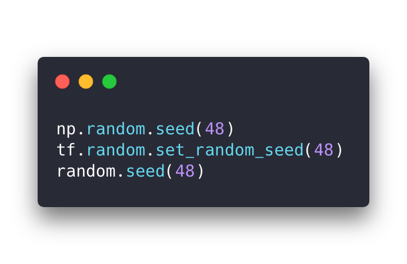
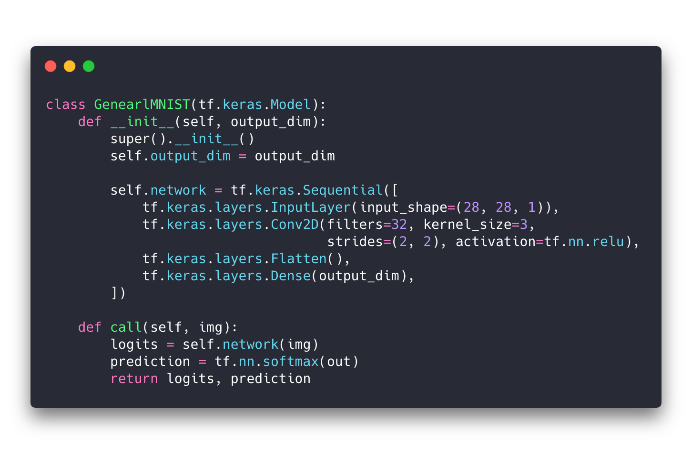
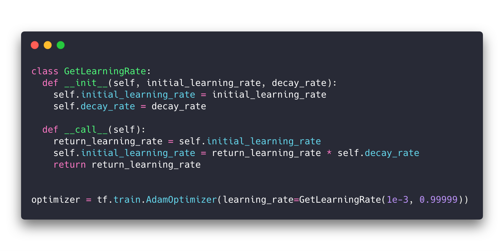
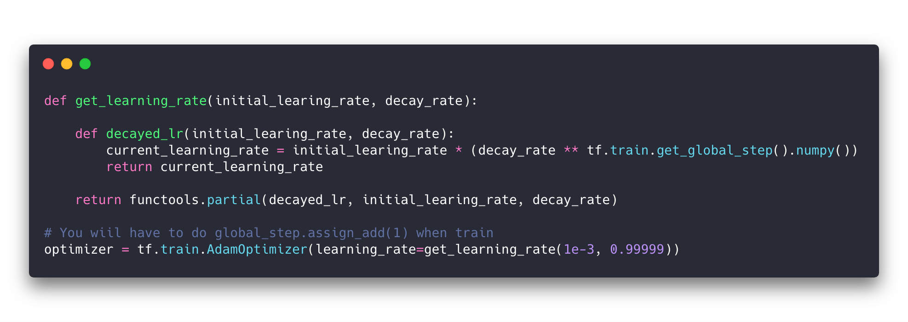
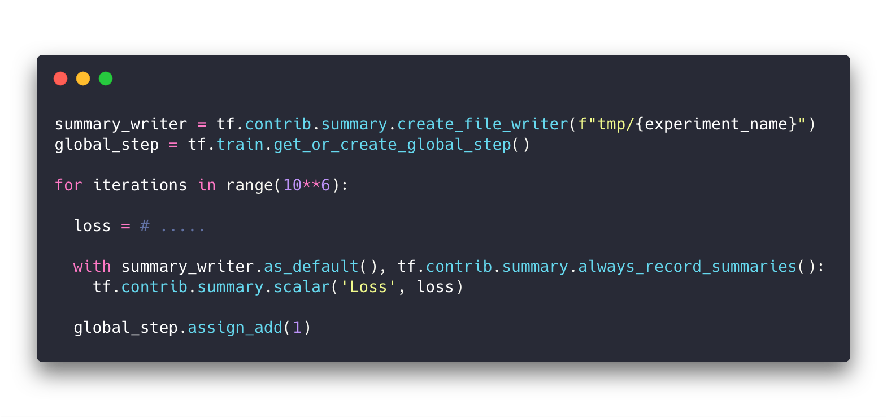
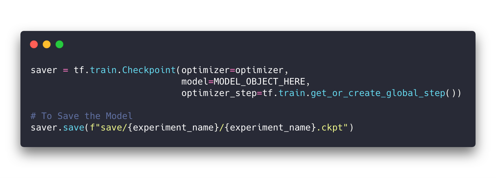
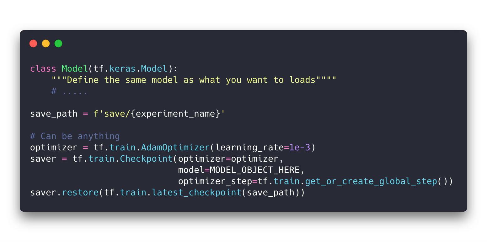

```{r setup, include=FALSE}
knitr::opts_chunk$set(echo = FALSE)
```

Suppose you want to start or alreary started a new deep learning project, there are some patterns to it, for example,

  * Defining a model
  * Define the optimizers
  * Start the training loops
  * Logged the Result
  * Saving the Model
  * Reusing a Model
  * Etc........

In this post, I will go through some of the template in which you can basically, copy and pasted into the code 😎 (At least it is useful for me, instead of searching through my own code-base, I can just copy the code here !!!!) Let Get started.

Some how, I couldn't get the highlighting to works, so I use https://carbon.now.sh instead, sorry for incovenience (i will look for better way to put a snippted inside the blog)


---

## Deep Learning In General

### Before Doing Anything

Define a Seed First, for reproducibility, with your favorite number (in this case it is 48 for me)

```{r fig.cap="Setting Up Seeds"}

```


### Defining a Model

Quick an simple you can use *tf.keras.Model* define your deep learning model.

```{r fig.cap="Quick Classifier"}

```

### Define an Optimizer With Variable Learning Rate

Now it is abit tricky for me at first, however, you can pass a fuction through a parameter called *learning_rate* inside the optimizer, which will get called everytime there is an update, and the optimizer expected the function to return a current learning rate.

For example, you want to your learning rate to decrease by _0.999_ everything the optimizer is called, there are 2 ways you can do that. First you can define the class, such that it got decreases everytime the object is called.

```{r fig.cap="Decay Learning Rate with Class"}

```

Or you can use tensorflow global variable for that, while using *functools.partial*

```{r fig.cap="Decay Learning Rate with Tensorflow Global Variable"}

```

### TensorBoard

First Define the summary writer, and then use it to log the files

```{r fig.cap="Saving Summary in Tensorboard"}

```

### Saving The Model/Use The Saved Checkpoint

To Save the model

```{r fig.cap="Saving Model"}

```

To use the model

```{r fig.cap="Reload the Model"}

```
